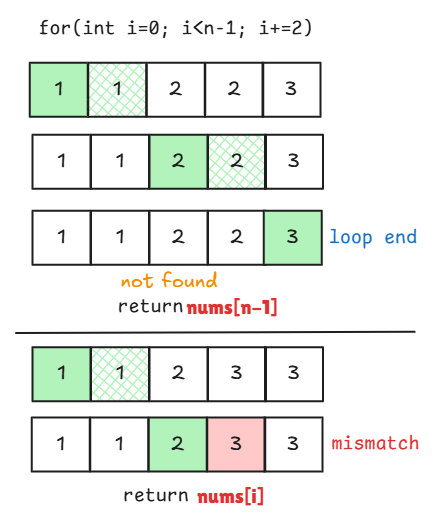
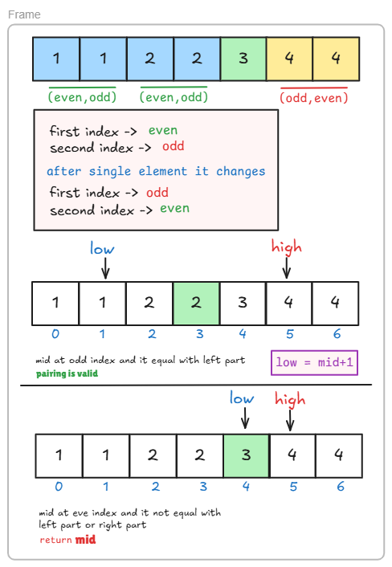

# [🔍 Single Element in Sorted Array](https://leetcode.com/problems/single-element-in-a-sorted-array/)

## 🤔 Problem

Given:

```text
Sorted array
Every element appears twice except ONE
```

👉 Find:

```text
The single non-duplicate element
```


# 🧠 Key Observation

```text
👉 Elements appear in pairs

👉 Before single element:
   first index = EVEN
   second index = ODD

👉 After single element:
   pattern breaks
```


# 🐢 Brute Force (Neighbor Check)

## 💡 Idea

```text
Check every element:
If it's not equal to left and right → answer
```

## 🧾 Code

```cpp
class Solution {
public:
    int singleNonDuplicate(vector<int>& arr) {
        int n = arr.size();

        // If array has only one element, return it
        if (n == 1) return arr[0];

        for (int i = 0; i < n; i++) {

            // Check if it's the first element and not equal to the next
            if (i == 0) {
                if (arr[i] != arr[i + 1])
                    return arr[i];
            }

            // Check if it's the last element and not equal to the previous
            else if (i == n - 1) {
                if (arr[i] != arr[i - 1])
                    return arr[i];
            }

            // Check if the current element is not equal to both neighbors
            else {
                if (arr[i] != arr[i - 1] && arr[i] != arr[i + 1])
                    return arr[i];
            }
        }

        // Dummy return if no element found (problem guarantees there is one)
        return -1;
    }
};
```

## ⏱️ Complexity

```text
Time: O(n)
Space: O(1)
```


# ⚡ Better Linear Approach (Pair Jump)

## 💡 Idea

```text
Since elements are in pairs,
check (i, i+1)

If mismatch → answer
```

## 🧾 Code

```cpp
class Solution {
public:
    int singleNonDuplicate(vector<int>& nums) {
        int n = nums.size();

        // optional for early return
        if(n == 1) return nums[0];

        for(int i=0; i<n-1; i+=2){
            if(nums[i+1] != nums[i]) return nums[i];
        }

        // if not found return last element
        return nums[n-1];
    }
};
```

## ⏱️ Complexity

```text
Time: O(n)
```

## 🖼️ Visualization



# ⚡ XOR Approach (Cleanest)

## 💡 Idea

```text
x ^ x = 0
x ^ 0 = x

👉 Pairs cancel out → single remains
```

## 🧾 Code

```cpp
class Solution {
public:
    int singleNonDuplicate(vector<int>& arr) {
        int n = arr.size();
        int ans = 0;

        for (int i = 0; i < n; i++) {
            ans ^= arr[i];
        }

        return ans;
    }
};
```

## ⏱️ Complexity

```text
Time: O(n)
Space: O(1)
```


# 🚀 Binary Search (Approach 1 – Parity Based)

## 💡 Idea

```text
Check pairing using index parity:

If pairing is correct → go right
If broken → go left
```

## 🧾 Code

```cpp
class Solution {
public:


int singleNonDuplicate(vector<int>& arr) {
    int n = arr.size();

    if (n == 1) return arr[0];

    // Edge case: first element is the unique one
    if (arr[0] != arr[1]) return arr[0];

    // Edge case: last element is the unique one
    if (arr[n - 1] != arr[n - 2]) return arr[n - 1];

    // Initialize binary search bounds (exclude first and last index)
    int low = 1, high = n - 2;

    while (low <= high) {
        int mid = (low + high) / 2;

        // Check if middle element is the unique one
        if (arr[mid] != arr[mid + 1] && arr[mid] != arr[mid - 1]) {
            return arr[mid];
        }

        // If mid is in the left half (pairing is valid)
        if ((mid % 2 == 1 && arr[mid] == arr[mid - 1]) ||
            (mid % 2 == 0 && arr[mid] == arr[mid + 1])) {
            // Move to the right half
            low = mid + 1;
        }
        // If mid is in the right half (pairing broken earlier)
        else {
            // Move to the left half
            high = mid - 1;
        }
    }

    // Dummy return (not reachable if input is valid)
    return -1;
   }
};
```


# 🚀 Binary Search (Approach 2 – CLEAN 🔥)

## 💡 Idea

```text
👉 Force mid to EVEN
👉 Compare (mid, mid+1)

If equal → go right
Else → go left
```


## 🧾 Code (BEST)

```cpp
class Solution {
public:
    int singleNonDuplicate(vector<int>& nums) {
        int low = 0, high = nums.size() - 1;

        while (low < high) {
            int mid = low + (high - low) / 2;

            // make mid even
            if (mid % 2 == 1) mid--;

            if (nums[mid] == nums[mid + 1]) {
                // pair is correct → single is on right
                low = mid + 2;
            } else {
                // pair is broken → single is on left (including mid)
                high = mid;
            }
        }

        return nums[low];
    }
};
```


## ⏱️ Complexity

```text
Time: O(log n)
Space: O(1)
```
## 🖼️ Visualization




# 🔥 Pattern Recognition

This is:

```text
Binary Search on INDEX PATTERN (pairing)
```

👉 Similar to:

- Peak element
- First/Last occurrence
- Rotated array logic


# ❌ Common Mistakes (VERY IMPORTANT)


## ❌ Mistake 1: Forgetting `mid % 2`

```text
Without fixing mid → wrong pairing
```


## ❌ Mistake 2: Using `low <= high` in clean approach

```text
May cause infinite loop

✔ Use:
while (low < high)
```


## ❌ Mistake 3: Skipping last element (linear)

```text
Always return nums[n-1] if not found
```


## ❌ Mistake 4: Misunderstanding pattern

```text
Pairing breaks AFTER single element
```


# ⚡ Dry Run (Important)

```text
nums = [1,1,2,3,3,4,4]
```

| low | mid | high | Action                     |
| --- | --- | ---- | -------------------------- |
| 0   | 3   | 6    | mid→2 (even), mismatch → L |
| 0   | 2   | 3    | match → right              |
| 2   | 2   | 2    | answer found               |

👉 answer = 2


# 🧠 One Line Intuition

```text
👉 Pairs follow pattern → single breaks it
👉 Binary search finds where pattern breaks
```
