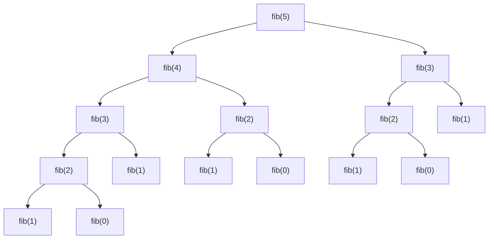
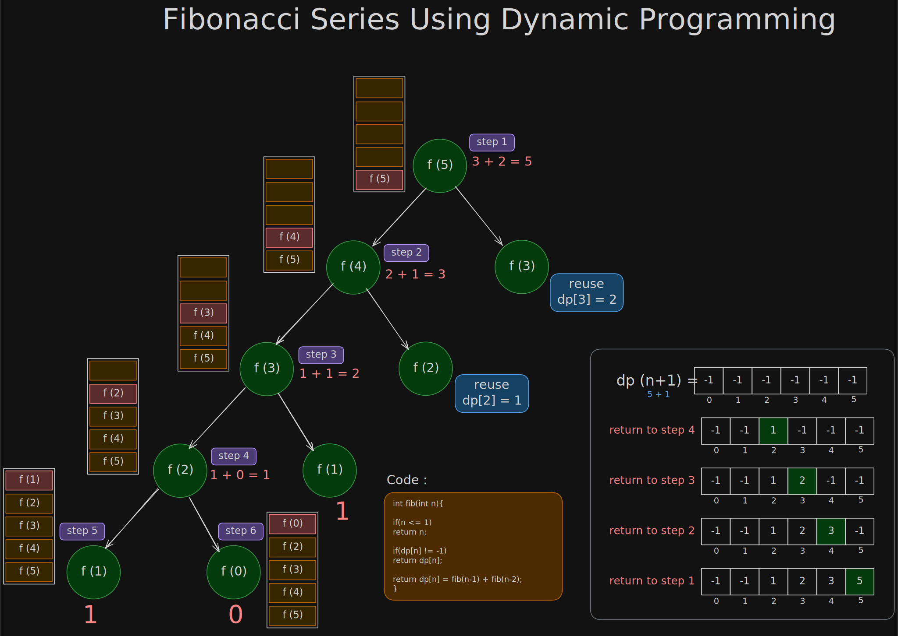
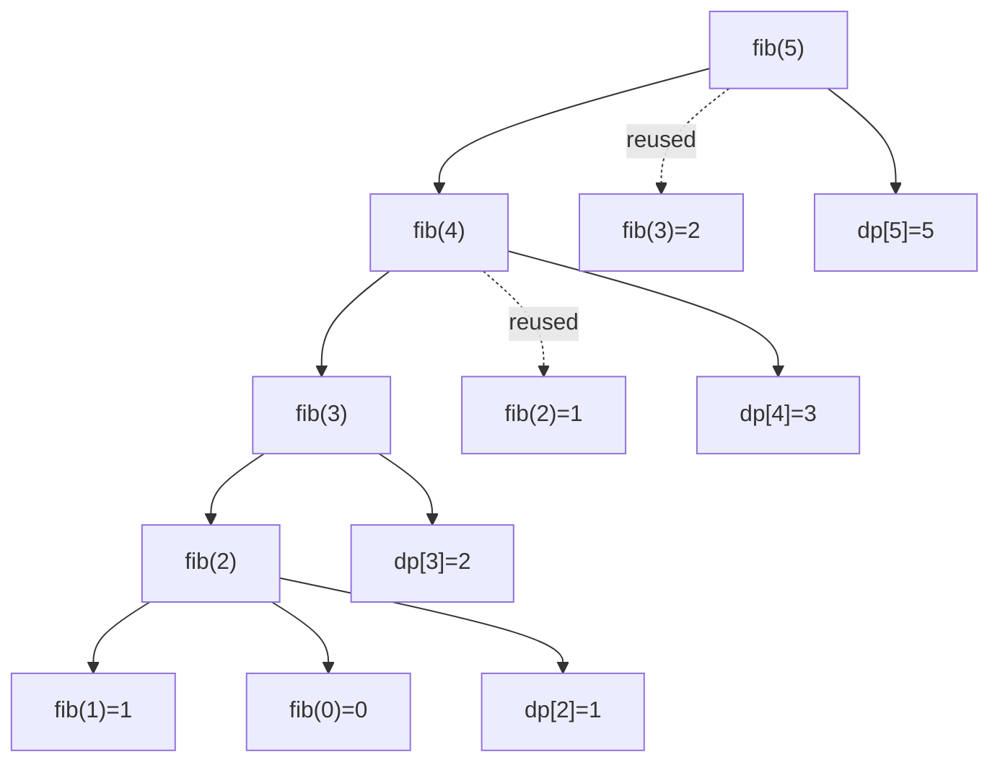

# 🧠 Fibonacci Series — Dynamic Programming

## ❓ Problem

Find:

```text
F(n)
```

where:

```text
F(0) = 0
F(1) = 1

F(n) = F(n-1) + F(n-2)
```

Example:

```text
0 1 1 2 3 5 8 13 ...
```

## 🌀 1. Normal Recursion

### 🧾 Code

```cpp id="wt98t4y"
int fib(int n){

    if(n <= 1)
        return n;

    return fib(n-1) + fib(n-2);
}
```

### 🌳 Recursion Tree for fib(5)



### 🚨 Main Problem

See repeated calls:

```text
fib(3) repeated
fib(2) repeated multiple times
```

This is called:

### 🔥 Overlapping Subproblems

Dynamic Programming works when:

```text
same subproblem repeats
```

### ⏱ Complexity

#### Time Complexity

Each call creates 2 more calls:

```text
O(2^n)
```

(exponential)

#### Space Complexity

Maximum recursion depth:

```text
fib(5)
fib(4)
fib(3)
fib(2)
fib(1)
```

Depth = n

So:

```text
O(n)
```

(recursion stack)

## 🌀 2. MEMOIZATION (TOP-DOWN DP)

### 💡 Idea

```text
Don't recompute same state again
Store already solved answers
```

### 🧾 Code

```cpp
class Solution {
public:

    int fib(int n, vector<int>& dp){

        // already computed
        if(dp[n] != -1)
            return dp[n];

        // base case
        if(n <= 1)
            return dp[n];

        // store and return
        return dp[n] =
            fib(n-1, dp) + fib(n-2, dp);
    }

    int fibonacci(int n){

        vector<int> dp(n+1, -1);

        return fib(n, dp);
    }
};
```

#### 🔥 MOST IMPORTANT IDEA

When:

```cpp id="7h4q6nk"
if(dp[n] != -1)
```

becomes true:

```text
NO recursion happens
```

### 🌳 Memoization Tree



#### Note:

```text
here dp[0] and dp[1] are not filled we are directly returning dp[n]
```

### 📦 DP Array Filling

```text
dp[0] = -1 (not filled)
dp[1] = -1 (not filled)
dp[2] = 1
dp[3] = 2
dp[4] = 3
dp[5] = 5
```

```text
For Storing the dp[0] and dp[1] we can change simly return dp[n] = n in base case;
```

### 🧾 Code

```cpp id="xzz2j1s"
// before
if(n <= 1)
    return dp[n];

// after
if(n <= 1)
    return dp[n] = n;
```

### 🌳 Memoization Tree

For:

```text
fib(5)
```



### 📦 DP Array Filling

```text
dp[0] = 0
dp[1] = 1
dp[2] = 1
dp[3] = 2
dp[4] = 3
dp[5] = 5
```

Direct return.

### ⏱ Time Complexity

### Number of unique states

```text
0 → n
```

Total:

```text
n+1 states
```

Each solved once.

So:

```text
O(n)
```

### ⏱ Space Complexity

Two things consume space:

#### 1. DP Array

```text
dp[0...n]
```

Size:

```text
O(n)
```

#### 2. Recursion Stack

Deepest chain:

```text
fib(n)
fib(n-1)
fib(n-2)
...
fib(1)
```

Depth:

```text
O(n)
```

### ✅ Total Space

```text
O(n) + O(n)
= O(2n)
= O(n)
```

(big-O ignores constants)

### 🧠 Why called TOP-DOWN?

Because:

```text
Start from big problem
Go downward recursively
```

```text
fib(5)
 → fib(4)
   → fib(3)
```

## 🌀 3. TABULATION (BOTTOM-UP DP)

### 💡 Idea

Instead of recursion:

```text
Build answers from small → large
```

### 🧾 Code

```cpp id="73n7v4k"
class Solution {
public:

    int fib(int n){

        vector<int> dp(n+1);

        dp[0] = 0;
        dp[1] = 1;

        for(int i = 2; i <= n; i++){

            dp[i] = dp[i-1] + dp[i-2];
        }

        return dp[n];
    }
};
```

### 🧠 Mental Model

```text
Already know:
fib(0)
fib(1)

Use them to build:
fib(2)
fib(3)
fib(4)
...
```

### 🌳 DP Table Building

For:

```text
n = 5
```

### Initial

```text
index : 0 1 2 3 4 5
dp    : 0 1 _ _ _ _
```

#### i = 2

```text
dp[2] = dp[1] + dp[0]
      = 1 + 0
      = 1
```

```text
0 1 1 _ _ _
```

#### i = 3

```text
dp[3] = dp[2] + dp[1]
      = 1 + 1
      = 2
```

```text
0 1 1 2 _ _
```

#### i = 4

```text
dp[4] = dp[3] + dp[2]
      = 2 + 1
      = 3
```

```text
0 1 1 2 3 _
```

#### i = 5

```text
dp[5] = dp[4] + dp[3]
      = 3 + 2
      = 5
```

```text
0 1 1 2 3 5
```

### ⏱ Time Complexity

Loop runs:

```text
2 → n
```

So:

```text
O(n)
```

### ⏱ Space Complexity

DP array size:

```text
O(n)
```

### 🧠 Why called BOTTOM-UP?

Because:

```text
Start from smallest states
Move upward
```

```text
fib(0)
fib(1)
→ fib(2)
→ fib(3)
→ fib(4)
```

([AlgoMap][2])

### 🔥 MEMOIZATION vs TABULATION

| Feature                | Memoization     | Tabulation       |
| ---------------------- | --------------- | ---------------- |
| Style                  | Recursive       | Iterative        |
| DP Type                | Top-Down        | Bottom-Up        |
| Stack Space            | Yes             | No               |
| Speed                  | Slightly slower | Faster           |
| Easy to write          | Easier          | Harder sometimes |
| Risk of stack overflow | Yes             | No               |

## 🌀 4. SPACE OPTIMIZATION

### 💡 Key Observation

For Fibonacci:

```text
dp[i] depends only on:
dp[i-1]
dp[i-2]
```

So entire array NOT needed.

Only previous 2 values needed.

### 🧾 Code

```cpp id="q4j9p42"
class Solution {
public:

    int fib(int n){

        if(n <= 1)
            return n;

        int prev2 = 0;
        int prev1 = 1;

        for(int i = 2; i <= n; i++){

            int curr = prev1 + prev2;

            prev2 = prev1;
            prev1 = curr;
        }

        return prev1;
    }
};
```

### 🧠 Dry Run

For:

```text
n = 5
```

#### Initial

```text
prev2 = 0
prev1 = 1
```

#### i = 2

```text
curr = 1 + 0 = 1

prev2 = 1
prev1 = 1
```

#### i = 3

```text
curr = 1 + 1 = 2

prev2 = 1
prev1 = 2
```

#### i = 4

```text
curr = 2 + 1 = 3

prev2 = 2
prev1 = 3
```

#### i = 5

```text
curr = 3 + 2 = 5

prev2 = 3
prev1 = 5
```

Answer:

```text
5
```

### ⏱ Time Complexity

Loop runs n times:

```text
O(n)
```

### ⏱ Space Complexity

Only variables used:

```text
prev1
prev2
curr
```

Constant memory:

```text
O(1)
```

### 🌟 FINAL EVOLUTION

```text
Recursion
   ↓
Memoization
   ↓
Tabulation
   ↓
Space Optimization
```

## 🧠 COMPLETE DP MENTAL MODEL

### Step 1

Write recursion.

### Step 2

Observe:

```text
overlapping subproblems
```

### Step 3

Add memoization.

### Step 4

Convert recursion → loop

(tabulation)

### Step 5

Observe dependencies.

If only previous states needed:

```text
space optimize
```

## 🔥 FINAL COMPLEXITY TABLE

| Approach        | Time   | Space |
| --------------- | ------ | ----- |
| Recursion       | O(2^n) | O(n)  |
| Memoization     | O(n)   | O(n)  |
| Tabulation      | O(n)   | O(n)  |
| Space Optimized | O(n)   | O(1)  |

[1]: https://www.w3tutorials.net/blog/time-complexity-of-memoization-fibonacci/?utm_source=chatgpt.com "Time Complexity of Memoization Fibonacci: How to Determine It (With Code Breakdown) — w3tutorials.net"
[2]: https://algomap.io/lessons/dynamic-programming?utm_source=chatgpt.com "Dynamic Programming: Memoization & Tabulation | AlgoMap"
[3]: https://www.naukri.com/code360/library/memoization-vs-tabulation?utm_source=chatgpt.com "Tabulation vs Memoization - Naukri Code 360"
[4]: https://www.michaelouroumis.com/en/blog/posts/dynamic-programming-tabulation-vs-memoization?utm_source=chatgpt.com "Dynamic Programming: Tabulation vs Memoization – Michael Ouroumis Blog"
