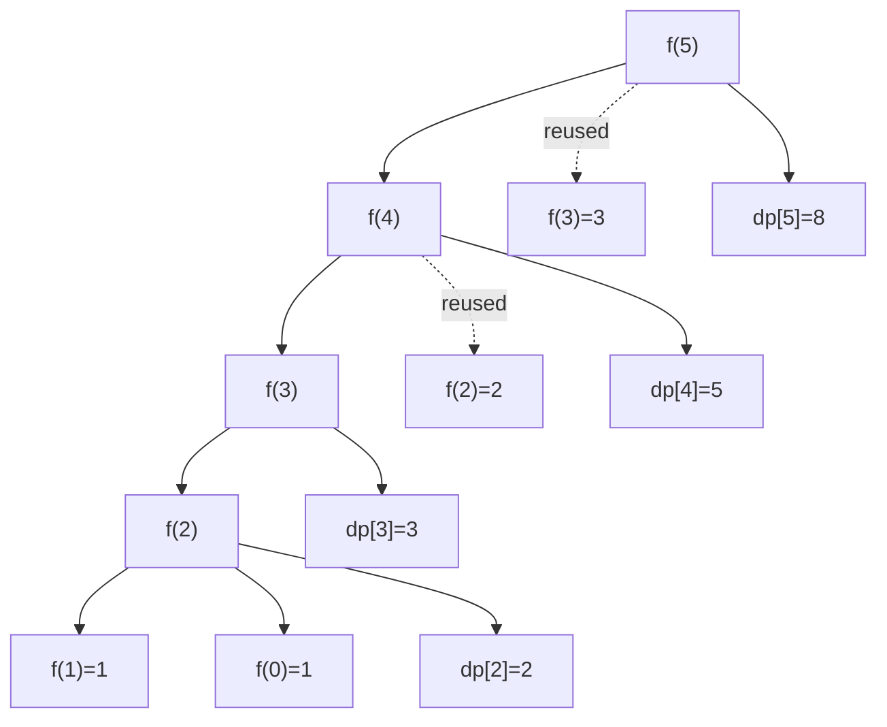

# 🧠 Climbing Stairs

## 🤔 Problem Statement

You are climbing a staircase.

At each move:

```text id="c1"
You can climb:
1 step
or
2 steps
```

👉 Find the total number of distinct ways to reach the nth stair.

## 📌 Example

### Input

```text id="c2"
n = 3
```

### Output

```text id="c3"
3
```

### Explanation

```text id="c4"
1 + 1 + 1
1 + 2
2 + 1
```

## 💡 Core Recurrence Relation

To reach stair `n`:

* either come from `n-1`
* or come from `n-2`

So recurrence becomes:

```text
f(n)=f(n-1)+f(n-2)
```

# 🌳 Recursion Approach

## 💡 Idea

At every stair:

* take 1 step
* take 2 steps

Explore all possible ways recursively.

## 🧾 Code

```cpp id="c5"
class Solution {
public:

    int climbStairs(int n) {

        if(n == 0)
            return 1;

        int step1 = climbStairs(n - 1);

        int step2 = 0;

        if(n - 2 >= 0)
            step2 = climbStairs(n - 2);

        return step1 + step2;
    }
};
```

## 🧠 Why Base Case Returns 1

```cpp id="c6"
if(n == 0)
    return 1;
```

Meaning:

```text id="c7"
One valid path is completed
```

Example:

```text id="c8"
2 → 0
```

means successfully reached top.

So contribute:

```text id="c9"
1 valid way
```


## ⏱ Time Complexity

Each function creates two more recursive calls.

Time Complexity:

```text
O(2^n)
```

## 📦 Space Complexity

Maximum recursion depth:

Depth = n

Space Complexity:

```text
O(n)
```

(recursion stack)

# 🚀 Memoization (Top-Down DP)

## 💡 Idea

Store already solved states.

If state already computed:

```cpp id="c15"
if(dp[n] != -1)
```

then directly return stored answer.

✅ No recursion needed.

## 🧾 Code

```cpp id="c16"
class Solution {
public:

    int solve(int n, vector<int>& dp){

        if(n <= 1)
            return 1;

        if(dp[n] != -1)
            return dp[n];

        return dp[n] =
            solve(n-1, dp) +
            solve(n-2, dp);
    }

    int climbStairs(int n) {

        vector<int> dp(n + 1, -1);

        return solve(n, dp);
    }
};
```

## 🌳 Memoization Tree




## ⏱ Time Complexity

States:

```text id="c19"
0 → n
```

Total states:

```text id="c20"
n + 1
```

Each state solved once.

Time Complexity:

```text
O(n)
```

## 📦 Space Complexity

### DP Array

Space:

```text
O(n)
```

### Recursion Stack

Maximum depth:

O(n)

### Total Space Complexity

```text id="c21"
O(n) + O(n)
= O(2n)
= O(n)
```


# 🚀 Tabulation (Bottom-Up DP)

## 🧾 Code

```cpp id="c24"
class Solution {
public:

    int climbStairs(int n) {

        vector<int> dp(n + 1);

        dp[0] = 1;
        dp[1] = 1;

        for(int i = 2; i <= n; i++){

            dp[i] = dp[i-1] + dp[i-2];
        }

        return dp[n];
    }
};
```

## 📦 DP Table Building

For:

```text id="c25"
n = 5
```

### Initial State

```text id="c26"
index : 0 1 2 3 4 5
dp    : 1 1 _ _ _ _
```

### i = 2

```text id="c27"
dp[2] = dp[1] + dp[0]
      = 1 + 1
      = 2
```

```text id="c28"
1 1 2 _ _ _
```

### i = 3

```text id="c29"
dp[3] = dp[2] + dp[1]
      = 2 + 1
      = 3
```

```text id="c30"
1 1 2 3 _ _
```

### i = 4

```text id="c31"
dp[4] = dp[3] + dp[2]
      = 3 + 2
      = 5
```

```text id="c32"
1 1 2 3 5 _
```

### i = 5

```text id="c33"
dp[5] = dp[4] + dp[3]
      = 5 + 3
      = 8
```

```text id="c34"
1 1 2 3 5 8
```

## ⏱ Time Complexity

Single loop runs from:

```text id="c35"
2 → n
```

Time Complexity:

O(n)

## 📦 Space Complexity

DP array size:

O(n)


# 🚀 Space Optimization

## 💡 Observation

Current state only depends on:

```text id="c38"
previous two states
```

```text id="c39"
dp[i-1]
dp[i-2]
```

So full DP array unnecessary.

## 🧾 Code

```cpp id="c40"
class Solution {
public:

    int climbStairs(int n) {

        if(n <= 1)
            return 1;

        int prev2 = 1;
        int prev1 = 1;

        for(int i = 2; i <= n; i++){

            int curr = prev1 + prev2;

            prev2 = prev1;
            prev1 = curr;
        }

        return prev1;
    }
};
```

## 🧠 Dry Run

For:

```text id="c41"
n = 5
```

### Initial

```text id="c42"
prev2 = 1
prev1 = 1
```

### i = 2

```text id="c43"
curr = 1 + 1 = 2

prev2 = 1
prev1 = 2
```

### i = 3

```text id="c44"
curr = 2 + 1 = 3

prev2 = 2
prev1 = 3
```

### i = 4

```text id="c45"
curr = 3 + 2 = 5

prev2 = 3
prev1 = 5
```

### i = 5

```text id="c46"
curr = 5 + 3 = 8

prev2 = 5
prev1 = 8
```

Answer:

```text id="c47"
8
```

## ⏱ Time Complexity

Single loop:

```text id="c48"
O(n)
```

## 📦 Space Complexity

Only variables used:

```text id="c48"
prev1
prev2
curr
```

Space Complexity:

```text
O(1)
```


# 🔥 Key Insight

Climbing Stairs is:

```text id="c49"
Fibonacci in disguise
```

because:

f(n)=f(n-1)+f(n-2)


## 🌟 DP Evolution

```text id="c50"
Recursion
   ↓
Memoization
   ↓
Tabulation
   ↓
Space Optimization
```

## 📊 Complexity Summary

| Approach        | Time Complexity | Space Complexity |
| --------------- | --------------- | ---------------- |
| Recursion       | O(2^n)          | O(n)             |
| Memoization     | O(n)            | O(n)             |
| Tabulation      | O(n)            | O(n)             |
| Space Optimized | O(n)            | O(1)             |

[1]: https://bignprimer.com/articles/blind-75/climbing-stairs?utm_source=chatgpt.com "Climbing Stairs — Fibonacci DP<!-- --> | BigN Primer"
[2]: https://www.reddit.com/r/learnprogramming/comments/j22mti?utm_source=chatgpt.com "Understanding the Climbing Stairs DP problem...."
[3]: https://www.geeksforgeeks.org/dsa/count-ways-reach-nth-stair/?utm_source=chatgpt.com "Climbing stairs to reach the top - GeeksforGeeks"
[4]: https://tracelit.dev/blog/climbing-stairs-visualization/?utm_source=chatgpt.com "LeetCode 70: Climbing Stairs — Step-by-Step Visual Trace"
[5]: https://www.educative.io/answers/climbing-stairs-leetcode?utm_source=chatgpt.com "Climbing Stairs LeetCode"
