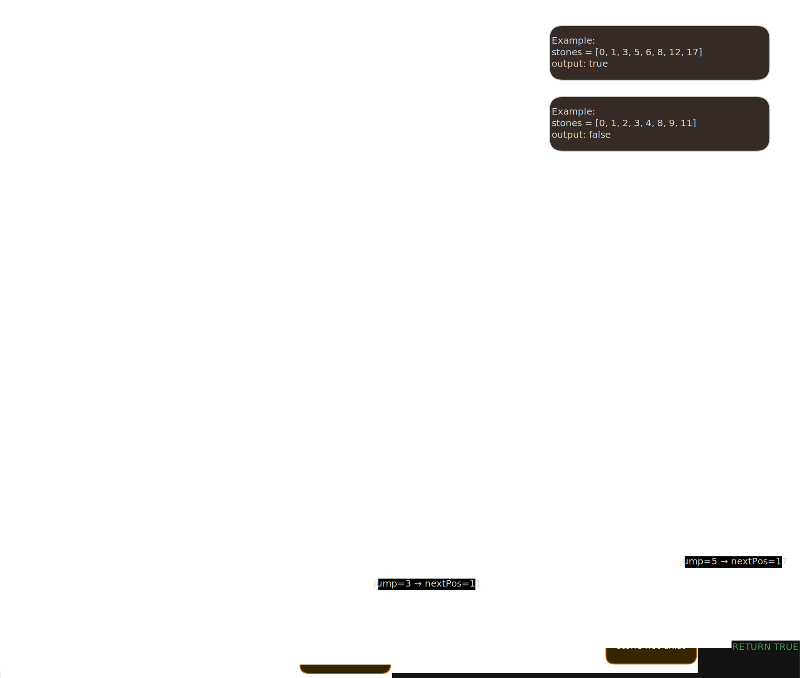
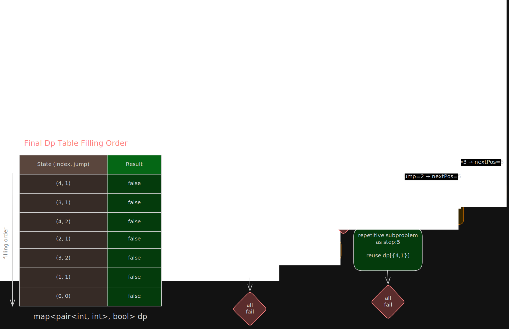

# 🐸 Frog Jump — Complete DP Evolution Notes

## 🤔 Problem Statement

Given:

```text
stones = sorted array of stone positions
```

Rules:

- Frog starts at stone `0`
- First jump must be `1`
- If last jump = `k`
  next jump can be:

```text
k - 1
k
k + 1
```

- Frog can only move forward
- Frog must land only on stones
- Frog cannot jump into water

👉 Return:

```text
true  -> frog can reach last stone
false -> frog cannot reach last stone
```

## 📌 Example 1

### Input

```text
stones = [0,1,3,5,6,8,12,17]
```

### Output

```text
true
```

### Explanation

Possible jumps:

```text
1 → 2 → 2 → 3 → 4 → 5
```

Path:

```text
0 → 1 → 3 → 5 → 8 → 12 → 17
```

## 📌 Example 2

### Input

```text
stones = [0,1,2,3,4,8,9,11]
```

### Output

```text
false
```

## 🔗 Jump to Solutions

- [Solution 1 - Extreme Brute Force DFS](#solution-1)
- [Solution 2 - Sorted Array Optimization](#solution-2)
- [Solution 3 - Binary Search Optimization](#solution-3)
- [Solution 4 - HashMap Optimization](#solution-4)
- [Solution 5 - Memoization (Top-Down DP)](#solution-5)
- [Solution 6 - Tabulation (Bottom-Up DP)](#solution-6)

## 🧠 Core DP Insight

### ❌ State is NOT only index

Normal 1D DP usually uses:

```text
dp[index]
```

BUT here future decisions depend on:

```text
previous jump size
```

So state becomes:

```text
(current stone index, previous jump)
```

### ✅ Actual DP State

```text
(index, lastJump)
```

Meaning:

```text
Can frog reach end from this state?
```

This is the MOST IMPORTANT observation of the problem.

## 🌳 Solution Evolution

```text
Extreme Brute Force DFS
        ↓
Sorted Array Optimization
        ↓
Binary Search Optimization
        ↓
HashMap Optimization
        ↓
Memoization (Top-Down DP)
        ↓
Tabulation (Bottom-Up DP)
```

<a id="solution-1"></a>

# 🌀 Solution 1 — Extreme Brute Force DFS

## 💡 Idea

At every stone:

```text
Try:
k - 1
k
k + 1
```

Then search entire remaining array to find the next stone.

## [🧾 Code](./01_normal_recursion.cpp)

```cpp
class Solution {
   public:
    bool dfs(int index, int lastJump, vector<int>& stones) {
        // reached last stone
        if (index == stones.size() - 1) return true;

        // try all 3 possible jumps (k-1, k, k+1)
        for (int jump = lastJump - 1; jump <= lastJump + 1; jump++) {
            if (jump <= 0) continue;

            int nextPos = stones[index] + jump;

            // search entire remaining array (find if this stone exists)
            for (int i = index + 1; i < stones.size(); i++) {
                if (stones[i] == nextPos) {
                    if (dfs(i, jump, stones)) return true;
                }
            }
        }

        return false;
    }

    bool canCross(vector<int>& stones) {
        return dfs(0, 0, stones);  // start at index 0, last jump = 0
    }
};
```

## 🌳 Recursion Tree (`stones = [0,1,3,5,6,8,12,17]`)



## 🚨 Problem in This Approach

> Repeated states happen again and again. may be recalculated multiple times.

This causes:

```text
Huge recursion explosion
```

## 🕰️ Complexity Analysis

### Time Complexity

Each state can branch into:

```text
3 possibilities
```

So worst case becomes:

```text
O(3ⁿ)
```

### Space Complexity

Maximum recursion depth:

```text
O(n)
```

(recursion stack)

<a id="solution-2"></a>

# 🌀 Solution 2 — Sorted Array Optimization

## 💡 Observation

**Array is sorted**.

So if:

```text
stones[i] > nextPos
```

then:

```text
all future stones will also be bigger
```

So we can stop searching early.

## [🧾 Optimized Code](./01_normal_recursion.cpp)

```cpp
class Solution {
   public:
    bool dfs(int index, int lastJump, vector<int>& stones) {
        if (index == stones.size() - 1) return true;

        for (int jump = lastJump - 1; jump <= lastJump + 1; jump++) {
            if (jump <= 0) continue;

            int nextPos = stones[index] + jump;

            for (int i = index + 1; i < stones.size(); i++) {
                //   optimization (as array is sorted)
                if (stones[i] > nextPos) break;

                if (stones[i] == nextPos) {
                    if (dfs(i, jump, stones)) return true;
                }
            }
        }

        return false;
    }

    bool canCross(vector<int>& stones) {
         return dfs(0, 0, stones);
    }
};
```

## 🔥 Improvement

Reduces unnecessary searching.

BUT:

```text
repeated recursion states still exist
```

So complexity remains exponential.

## 🕰️ Complexity

### Time Complexity

```text
O(3ⁿ)
```

### Space Complexity

```text
O(n)
```

<a id="solution-3"></a>

# 🌀 Solution 3 — Binary Search Optimization

## 💡 Idea

Since array is sorted:

```text
Use binary search instead of linear scan
```

## 🧾 Code

```cpp
class Solution {
    public:
    bool dfs(int index, int lastJump, vector<int>& stones) {
        if (index == stones.size() - 1) return true;

        for (int jump = lastJump - 1; jump <= lastJump + 1; jump++) {
            if (jump <= 0) continue;

            int nextPos = stones[index] + jump;

            // binary search
            // returns iterator to first element >= nextPos
            auto stoneIterator = lower_bound(stones.begin(), stones.end(), nextPos);

            // verify stone actually exists & position equal to nextPos
            if (stoneIterator != stones.end() && *stoneIterator == nextPos) {
                // convert iterator to index
                int nextIndex = stoneIterator - stones.begin();

                if (dfs(nextIndex, jump, stones)) return true;
            }
        }

        return false;
    }

    bool canCross(vector<int>& stones) {
        return dfs(0, 0, stones);
    }
}
```

> Note: `lower_bound` is a C++ STL function that performs binary search. It returns an iterator pointing to the first element in the range that is not less than (i.e., greater than or equal to) the specified value. If no such element is found, it returns an iterator to the **end()** of the range.

## 🔥 Improvement

Finding next stone becomes:

```text
O(log n)
```

instead of:

```text
O(n)
```

## 🕰️ Complexity

### Time Complexity

```text
O(3ⁿ log n)
```

### Space Complexity

```text
O(n)
```

<a id="solution-4"></a>

# 🌀 Solution 4 — HashMap Optimization

## 💡 Idea

Store:

```text
stone_position → index
```

inside HashMap.

Then next stone lookup becomes:

```text
O(1)
```

## [🧾 Code](./03_using_map.cpp)

```cpp
class Solution {
   public:
    bool dfs(int index, int lastJump, vector<int>& stones, unordered_map<int, int> pos) {
        if (index == stones.size() - 1) return true;

        for (int jump = lastJump - 1; jump <= lastJump + 1; jump++) {
            if (jump <= 0) continue;

            int nextPos = stones[index] + jump;

            /**
             * Check if nextPos exists in the map
             * If it does, get the corresponding index and continue DFS
             *
             * if (pos.count(nextPos)) {
                int nextIndex = pos[nextPos];

                if (dfs(nextIndex, jump, stones, pos)) return true;
            }
             */

            auto it = pos.find(nextPos);

            if (it != pos.end()) {
                int nextIndex = it->second;
                if (dfs(nextIndex, jump, stones, pos)) return true;
            }
        }

        return false;
    }

    bool canCross(vector<int>& stones) {
        unordered_map<int, int> pos;

        for (int i = 0; i < stones.size(); i++) {
            pos[stones[i]] = i;
        }

        return dfs(0, 0, stones, pos);
    }
};
```

## 🔥 Improvement

Stone finding becomes:

```text
O(1)
```

instead of:

```text
O(n)
or
O(log n)
```

## 🚨 Problem Still Exists

Repeated recursion states are STILL recalculated.

So recursion explosion still exists.

## 🕰️ Complexity

### Time Complexity

```text
O(3ⁿ)
```

(practically faster)

### Space Complexity

```text
O(n)
```

<a id="solution-5"></a>

# 🌀 Solution 5 — Memoization (Top-Down DP)

## 💡 Core Idea

Store already solved states.

If state already solved:

```text
directly return answer
```

No repeated recursion.

## 🧠 DP State

```text
dp[index][lastJump]
```

Meaning:

```text
Can frog reach end from here?
```

## [🧾 Code](./memoization.cpp)

```cpp
class Solution {
    public:
    bool dfs(int index, int lastJump, vector<int>& stones, unordered_map<int, int>& pos,
        map<pair<int, int>, bool>& dp) {

        if (index == stones.size() - 1) return true;

        // already solved
        if (dp.count({index, lastJump}))
            return dp[{index, lastJump}];

        for (int jump = lastJump - 1; jump <= lastJump + 1; jump++) {
            if (jump <= 0) continue;

            int nextPos = stones[index] + jump;

            if (pos.count(nextPos)) {
                int nextIndex = pos[nextPos];

                if (dfs(nextIndex, jump, stones, pos, dp))
                    return dp[{index, lastJump}] = true;
            }
        }

        return dp[{index, lastJump}] = false;
    }

    bool canCross(vector<int>& stones) {
        unordered_map<int, int> pos;
        map<pair<int, int>, bool> dp;

        for (int i = 0; i < stones.size(); i++) {
            pos[stones[i]] = i;
        }

        return dfs(0, 0, stones, pos, dp);
    }
};
```

## 🌳 Memoization Tree(`stones = [0,1,2,3,4,12]`)



🔥 Repeated state reused from DP.

## 🕰️ Complexity Analysis

### Number of States

State:

```text
(index, jump)
```

Both can vary up to `n`.

Total states:

```text
O(n²)
```

### Time Complexity

```text
O(n²)
```

### Space Complexity

DP table + recursion stack:

```text
O(n²)
```

<a id="solution-6"></a>

# 🌀 Solution 6 — Tabulation (Bottom-Up DP)

## 💡 Idea

Instead of recursion:

```text
Build answer iteratively
```

Store:

```text
Which jump sizes can reach each stone
```

## 🧠 DP Definition

```text
dp[stone] = set of valid jumps
```

Meaning:

```text
Which jump sizes can land on this stone?
```

## [🧾 Code](./05_tabulation.cpp)

```cpp
class Solution {
   public:
    bool canCross(vector<int>& stones) {
        unordered_map<int, unordered_set<int>> dp;

        // initialize
        for (int stone : stones) {
            dp[stone] = {};
        }

        dp[0].insert(0);

        for (int stone : stones) {
            for (int jump : dp[stone]) {
                for (int nextJump = jump - 1; nextJump <= jump + 1; nextJump++) {
                    if (nextJump <= 0) continue;

                    int nextStone = stone + nextJump;

                    if (dp.count(nextStone)) {
                        dp[nextStone].insert(nextJump);
                    }
                }
            }
        }

        return !dp[stones.back()].empty();
    }
};
```

## 📦 DP Table Visualization

For:

```text
stones = [0,1,3,5]
```

### Initial State

```text
dp[0] = {0}
```

### From Stone 0

Possible jump:

```text
1
```

So:

```text
dp[1] = {1}
```

### From Stone 1

Possible next jumps:

```text
0,1,2
```

Valid:

```text
2
```

So:

```text
dp[3] = {2}
```

### From Stone 3

Possible next jumps:

```text
1,2,3
```

Valid:

```text
2
```

So:

```text
dp[5] = {2}
```

## 🕰️ Complexity

### Time Complexity

**O(n²)**

### Space Complexity

**O(n²)**

## 🚨 Space Optimization?

### ❌ True O(1) Space Optimization NOT Possible

Unlike Fibonacci:

```text
Only previous 2 states needed
```

Here:

```text
Many previous jump states needed simultaneously
```

State depends on:

```text
(index, jump)
```

So true constant-space optimization is impossible.

## 🌟 Final Complexity Comparison

| Solution            | Stone Lookup | Repeated States | Time Complexity | Space Complexity |
| ------------------- | ------------ | --------------- | --------------- | ---------------- |
| Extreme DFS         | O(n)         | YES             | O(3ⁿ)           | O(n)             |
| Sorted Optimization | O(n)         | YES             | O(3ⁿ)           | O(n)             |
| Binary Search       | O(log n)     | YES             | O(3ⁿ log n)     | O(n)             |
| HashMap DFS         | O(1)         | YES             | O(3ⁿ)           | O(n)             |
| Memoization DP      | O(1)         | NO              | **O(n²)**       | **O(n²)**        |
| Tabulation DP       | O(1)         | NO              | **O(n²)**       | **O(n²)**        |

## 🔥 Interview Mental Model

### Frog Jump is NOT a Normal 1D DP

Because:

```text
position alone is insufficient
```

Need:

```text
(position, previous jump)
```

That creates:

```text
2D DP state
```

This is the entire core of the problem.
