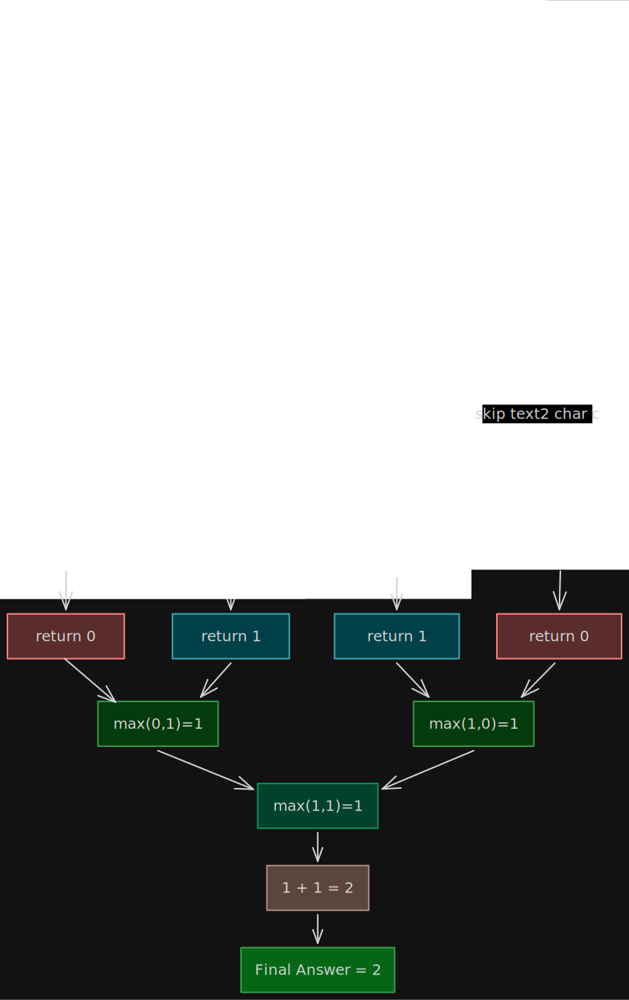
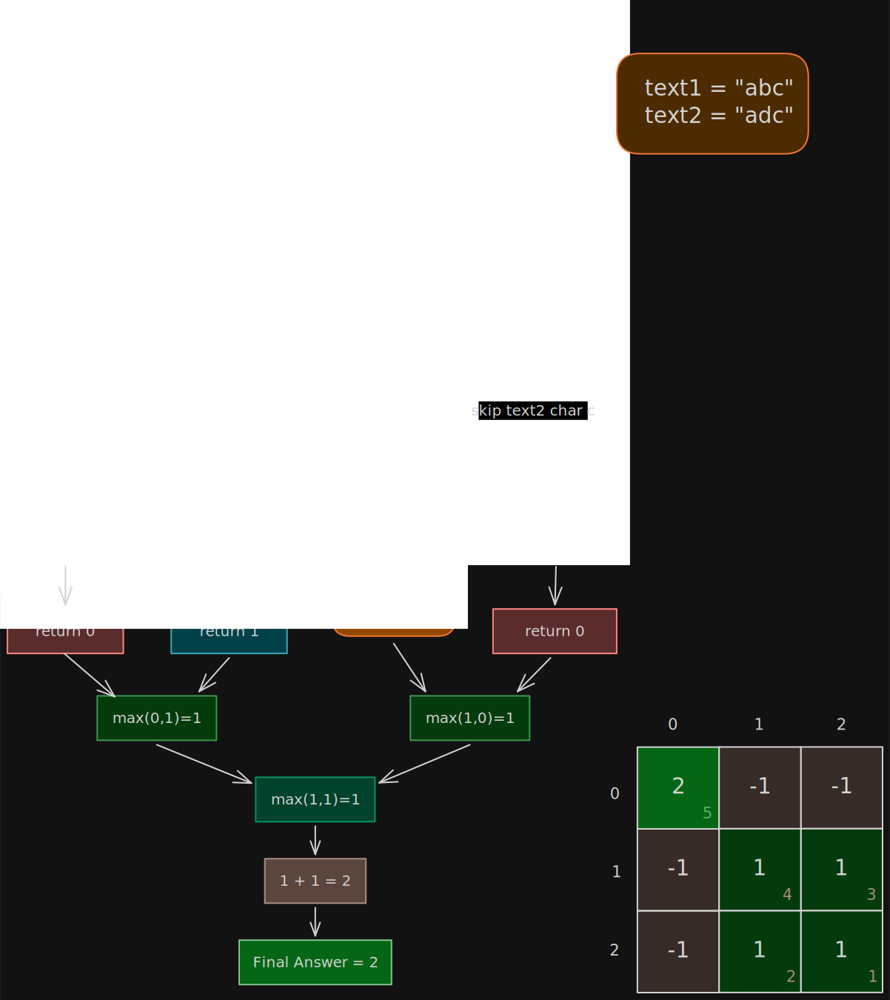

# 📚 Longest Common Subsequence (LCS) — Dynamic Programming on Strings

## 🤔 Problem Statement

Given two strings `text1` and `text2`, return the length of their **Longest Common Subsequence**.

A subsequence is formed by deleting some (or no) characters without changing the relative order. ([Wikipedia][1])

## ✅ Example

```text
text1 = "abcde"
text2 = "ace"

Output = 3
```

Because:

```text
"ace"
```

is common in both strings.

## 🎭 Solutions

### 1. [Recursion](./recursion.cpp)

### 2. [Memoization (Top Down DP)](./memoization.cpp)

### 3. [Tabulation (Bottom Up DP)](./tabulation.cpp)

### 4. [Space Optimization](./space-optimization.cpp)

## 🧠 What is a Subsequence?

A subsequence maintains relative order but characters can be skipped.

### Example

```text
String = "abc"
```

Possible subsequences:

```text
"", "a", "b", "c",
"ab", "ac", "bc",
"abc"
```

❌ `"ca"` is NOT a subsequence because order changed.

## 🌳 Recursive Thinking

Define:

```text
f(i, j)
```

Meaning:

> LCS length between:
>
> `text1[i...]`
> and
> `text2[j...]`

## 🌳 Recursion Tree Intuition

Example:

```text
text1 = "ab"
text2 = "ac"
```

```text
f(0,0)

a == a
→ 1 + f(1,1)

b != c

max(
    f(2,1),
    f(1,2)
)
```

## ✅ Recursive Solution

```cpp
#include <bits/stdc++.h>

using namespace std;

class Solution {
    int dfs(int index1, int index2, string& s1, string& s2) {

        // One string exhausted
        if (index1 == s1.size() || index2 == s2.size()) {
            return 0;
        }

        // Characters match
        if (s1[index1] == s2[index2]) {
            return 1 + dfs(index1 + 1, index2 + 1, s1, s2);
        }

        // Skip from either string
        return max(dfs(index1 + 1, index2, s1, s2),dfs(index1, index2 + 1, s1, s2));
    }

   public:
    int longestCommonSubsequence(string s1, string s2) {

        return dfs(0, 0, s1, s2);
    }
};
```

### ⏰ Complexity Analysis

| Complexity | Value                  |
| ---------- | ---------------------- |
| Time       | O(2^(n+m))             |
| Space      | O(n+m) recursion stack |

## 🌳 Recursion Tree (3 × 3 Example)

Example:

```text
text1 = "abc"
text2 = "adc"
```



## ⚠️ Problem with Recursion

The same states are solved repeatedly.

Example:

```text
f(3,5)
```

may be computed many times.

This creates overlapping subproblems.

## 💾 Memoization (Top Down DP)

Store already computed states.

## 🎯 DP State

```text
dp[i][j]
```

Meaning:

> LCS length between:
>
> `text1[i...]`
> and
> `text2[j...]`

## ✅ Memoization Solution

```cpp
class Solution {
    int dfs(int index1, int index2, string& s1, string& s2, vector<vector<int>>& dp) {
        // One string exhausted (base case)
        if (index1 == s1.size() || index2 == s2.size()) return 0;

        // Already solved
        if (dp[index1][index2] != -1) return dp[index1][index2];

        // Characters match
        if (s1[index1] == s2[index2]) {
            return dp[index1][index2] = 1 + dfs(index1 + 1, index2 + 1, s1, s2, dp);
        }

        // Skip from either string
        return dp[index1][index2] =
                   max(dfs(index1 + 1, index2, s1, s2, dp), dfs(index1, index2 + 1, s1, s2, dp));
    }

   public:
    int longestCommonSubsequence(string s1, string s2) {
        int n = s1.size();
        int m = s2.size();

        vector<vector<int>> dp(n, vector<int>(m, -1));

        int ans = dfs(0, 0, s1, s2, dp);

        for (int i = 0; i < n; i++) {
            for (int j = 0; j < m; j++) {
                cout << dp[i][j] << " ";
            }
            cout << endl;
        }
        return ans;
    }
};
```

### ⏰ Complexity Analysis

| Complexity | Value                      |
| ---------- | -------------------------- |
| Time       | O(n × m)                   |
| Space      | O(n × m) + recursion stack |

## 🌳 Recursion Tree (3 × 3 Example)

Example:

```text
text1 = "abc"
text2 = "adc"
```



## 📦 Tabulation (Bottom Up DP)

Instead of recursion:

- start from base cases
- build answer bottom-up

## 🎯 DP Table Meaning

```text
dp[i][j]
```

Meaning:

> LCS length between:
>
> `text1[i...]`
> and
> `text2[j...]`

## 📌 Transition

### Match

```text
dp[i][j] = 1 + dp[i+1][j+1]
```

### Not Match

```text
dp[i][j] = max(
    dp[i+1][j],
    dp[i][j+1]
)
```

## ✅ Tabulation Solution

```cpp
class Solution {
   public:
    int longestCommonSubsequence(string text1, string text2) {
        int n = text1.size();
        int m = text2.size();

        vector<vector<int>> dp(n + 1, vector<int>(m + 1, 0));

        for (int i = n - 1; i >= 0; i--) {
            for (int j = m - 1; j >= 0; j--) {
                // Characters match
                if (text1[i] == text2[j]) {
                    dp[i][j] = 1 + dp[i + 1][j + 1];
                }

                // Characters do not match
                else {
                    dp[i][j] = max(dp[i + 1][j], dp[i][j + 1]);
                }
            }
        }

        return dp[0][0];
    }
};
```

### ⏱ Complexity Analysis

| Complexity | Value    |
| ---------- | -------- |
| Time       | O(n × m) |
| Space      | O(n × m) |

## 📊 DP Table Dry Run

Example:

```text
text1 = "abcde"
text2 = "ace"
```

| i/j | a   | c   | e   | 0   |
| --- | --- | --- | --- | --- |
| a   | 3   | 2   | 1   | 0   |
| b   | 2   | 2   | 1   | 0   |
| c   | 2   | 2   | 1   | 0   |
| d   | 1   | 1   | 1   | 0   |
| e   | 1   | 1   | 1   | 0   |
| 0   | 0   | 0   | 0   | 0   |

## 🚀 Space Optimization

Observe:

```text
dp[i][j]
```

depends only on:

- current row
- next row

So:

```text
O(n × m)
→
O(m)
```

## ✅ Space Optimized Solution

```cpp
class Solution {
   public:
    int longestCommonSubsequence(string text1, string text2) {
        int n = text1.size();
        int m = text2.size();

        vector<int> nextRow(m + 1, 0);
        vector<int> currentRow(m + 1, 0);

        for (int i = n - 1; i >= 0; i--) {
            for (int j = m - 1; j >= 0; j--) {
                // Characters match
                if (text1[i] == text2[j]) {
                    currentRow[j] = 1 + nextRow[j + 1];
                }

                // Characters do not match
                else {
                    currentRow[j] = max(nextRow[j], currentRow[j + 1]);
                }
            }

            nextRow = currentRow;
        }

        return nextRow[0];
    }
};
```

### ⏱ Complexity Analysis

| Complexity | Value    |
| ---------- | -------- |
| Time       | O(n × m) |
| Space      | O(m)     |

## 🧠 Core DP Pattern Learned

This problem teaches:

### 🎯 DP on Two Strings

State generally becomes:

```text
f(i, j)
```

Meaning:

> answer using suffixes/prefixes of two strings

This same pattern appears in many advanced string DP problems.

## 📌 Important Interview Problems

- Longest Common Substring
- Shortest Common Supersequence
- Edit Distance
- Distinct Subsequences
- Longest Palindromic Subsequence

## ⏱ Final Complexity Comparison

| Approach           | Time       | Space    |
| ------------------ | ---------- | -------- |
| Recursion          | O(2^(n+m)) | O(n+m)   |
| Memoization        | O(n × m)   | O(n × m) |
| Tabulation         | O(n × m)   | O(n × m) |
| Space Optimization | O(n × m)   | O(m)     |

## 🎯 Key Interview Insight

When characters match:

```text
take both characters
```

When characters do not match:

```text
try skipping from either string
```

That branching is the main reason Dynamic Programming is needed. ([Wikipedia][1])

[1]: https://en.wikipedia.org/wiki/Longest_common_subsequence?utm_source=chatgpt.com "Longest common subsequence"
