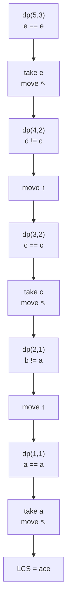

# 📚 Print Longest Common Subsequence (LCS)

## 🤔 Problem Statement

Given two strings `text1` and `text2`, print one **Longest Common Subsequence**.

---

## ✅ Example

```text id="myxtxq"
text1 = "abcde"
text2 = "ace"
```

Output:

```text id="zjlwmv"
"ace"
```

---

## 🧠 Core Idea

First:

* build the normal LCS DP table
* store LCS lengths

Then:

* backtrack from `dp[n][m]`
* reconstruct the actual string

This is the standard approach used in interviews and competitive programming. ([GeeksforGeeks][1])

---

# 🎯 DP State

```text id="h33qg7"
dp[i][j]
```

Meaning:

> LCS length between:
>
> `text1[0...i-1]`
> and
> `text2[0...j-1]`

---

# 📌 Transition

## Characters Match

dp[i][j]=1+dp[i-1][j-1]

---

## Characters Do Not Match

dp[i][j]=\max(dp[i-1][j],dp[i][j-1])

---

# 📦 Step 1 — Build DP Table

Suppose:

```text id="4h85s0"
text1 = "abcde"
text2 = "ace"
```

---

## DP Table

|   | 0 | a | c | e |
| - | - | - | - | - |
| 0 | 0 | 0 | 0 | 0 |
| a | 0 | 1 | 1 | 1 |
| b | 0 | 1 | 1 | 1 |
| c | 0 | 1 | 2 | 2 |
| d | 0 | 1 | 2 | 2 |
| e | 0 | 1 | 2 | 3 |

---

# 🧠 Backtracking Idea

Start from:

```text id="px7aqz"
dp[n][m]
```

Move backward.

---

## If Characters Match

Take character into answer.

Move diagonally:

↖️

---

## If Characters Do Not Match

Move toward larger value:

* up ↑
* left ←

---

# 🌳 Backtracking Visualization



---

# ✅ Complete Code (Print LCS)

```cpp id="vgb50m"
#include <bits/stdc++.h>
using namespace std;

class Solution {
   public:
    string longestCommonSubsequence(string text1, string text2) {
        int n = text1.size();
        int m = text2.size();

        vector<vector<int>> dp(n + 1, vector<int>(m + 1, 0));

        // Build DP table
        for (int i = 1; i <= n; i++) {
            for (int j = 1; j <= m; j++) {
                // Characters match
                if (text1[i - 1] == text2[j - 1]) {
                    dp[i][j] = 1 + dp[i - 1][j - 1];
                }

                // Characters do not match
                else {
                    dp[i][j] = max(dp[i - 1][j], dp[i][j - 1]);
                }
            }
        }

        // Backtracking
        int i = n;
        int j = m;

        string lcs = "";

        while (i > 0 && j > 0) {
            // Characters match
            if (text1[i - 1] == text2[j - 1]) {
                lcs += text1[i - 1];

                i--;
                j--;
            }

            // Move upward
            else if (dp[i - 1][j] > dp[i][j - 1]) {
                i--;
            }

            // Move left
            else {
                j--;
            }
        }

        reverse(lcs.begin(), lcs.end());

        return lcs;
    }
};
```


# ⏱ Complexity Analysis

| Complexity | Value    |
| ---------- | -------- |
| Time       | O(n × m) |
| Space      | O(n × m) |

---

# 🧠 Why Reverse Needed?

During backtracking:

* we start from end
* characters are collected backward

Example:

```text id="z9y0g9"
e → c → a
```

So reverse is required.

---

# 🔥 Important Interview Insight

## Match Case

Take character:

```text id="u3kix2"
move diagonally
```

because both indices are used.

---

## Mismatch Case

Move toward larger DP value:

```text id="cvj9w5"
up or left
```

because that direction contains longer subsequence.

---

# 📌 Dry Run

Example:

```text id="6kpr0m"
text1 = "AGGTAB"
text2 = "GXTXAYB"
```

Backtracking path gives:

```text id="0nk9yy"
GTAB
```

Length = `4` ([GeeksforGeeks][1])

---

# ⚠ Important Note

Sometimes multiple valid LCS strings exist.

Example:

```text id="91u81x"
text1 = "abc"
text2 = "bac"
```

Possible answers:

```text id="n4qdfz"
"ac"
```

or

```text id="3zc8d2"
"bc"
```

Both are correct.

---

# 🎯 Core Pattern Learned

## First Phase

Compute:

```text id="kt2jwx"
LCS length
```

using DP.

---

## Second Phase

Backtrack through table to reconstruct answer.

This same pattern is used in:

* Print Shortest Common Supersequence
* Diff tools
* Edit sequence reconstruction
* String alignment problems

