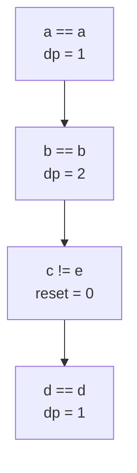

# 📚 Longest Common Substring — Dynamic Programming on Strings

## 🤔 Problem Statement

Given two strings `s1` and `s2`, find the length of the **Longest Common Substring**.

A substring is a contiguous sequence of characters. ([Wikipedia][1])

## ✅ Example

```text id="q9h44k"
s1 = "abcdxyz"
s2 = "xyzabcd"

Output = 4
```

Because:

```text id="j78xf5"
"abcd"
```

is the longest common substring.

## 🧠 Difference Between Subsequence vs Substring

| Subsequence                  | Substring                     |
| ---------------------------- | ----------------------------- |
| Characters can be skipped    | Characters must be contiguous |
| `"ace"` from `"abcde"` valid | `"ace"` NOT valid substring   |
| Order matters                | Order + continuity matter     |

## 🌳 Recursive Thinking

Define:

```text id="v6t7lq"
f(i, j)
```

Meaning:

> length of longest common substring
>
> ending at:
>
> `s1[i]`
> and
> `s2[j]`

## 🎯 Key Observation

### If characters match

We extend previous substring.

f(i,j)=1+f(i-1,j-1)

### If characters do not match

Substring continuity breaks.

f(i,j)=0

## ⚠ Most Important Difference from LCS

In LCS:

```text id="z7y5zg"
take max(left, top)
```

In Longest Common Substring:

```text id="8d4r9i"
reset to 0
```

Because substring must remain contiguous. ([Reddit][2])

## 🌳 Recursive Intuition

Example:

```text id="f56xtf"
s1 = "abc"
s2 = "adc"
```

### Matching Flow

```text id="tq6gx2"
a == a → length becomes 1

b != d → reset to 0

c == c → length becomes 1
```

## ❌ Pure Recursion

A pure recursion solution becomes complicated because:

- current length must be tracked
- mismatch resets substring length
- overlapping subproblems exist

So this problem is usually solved directly using DP.

## 🎯 DP State

```text id="v1nduh"
dp[i][j]
```

Meaning:

> length of longest common substring
>
> ending at:
>
> `s1[i-1]`
> and
> `s2[j-1]`

## 📌 Transition

### Characters Match

```text id="6z44qm"
dp[i][j] = 1 + dp[i-1][j-1]
```

### Characters Do Not Match

```text id="ll4j5r"
dp[i][j] = 0
```

## ✅ Tabulation Solution

```cpp id="kjgmvv"
#include <bits/stdc++.h>
using namespace std;

class Solution {
   public:
    int longestCommonSubstring(string s1, string s2) {
        int n = s1.size();
        int m = s2.size();

        vector<vector<int>> dp(n + 1, vector<int>(m + 1, 0));

        int maximumLength = 0;

        for (int i = 1; i <= n; i++) {
            for (int j = 1; j <= m; j++) {
                // Characters match
                if (s1[i - 1] == s2[j - 1]) {
                    dp[i][j] = 1 + dp[i - 1][j - 1];
                    maximumLength = max(maximumLength, dp[i][j]);
                }

                // Characters do not match
                else {
                    dp[i][j] = 0;
                }
            }
        }

        return maximumLength;
    }
};
```

### ⏱ Complexity Analysis

| Complexity | Value    |
| ---------- | -------- |
| Time       | O(n × m) |
| Space      | O(n × m) |

## 📊 DP Table Dry Run

Example:

```text id="l3vby0"
s1 = "abcjklp"
s2 = "acjkp"
```

## DP Table

|     | a   | c   | j   | k   | p   |
| --- | --- | --- | --- | --- | --- |
| a   | 1   | 0   | 0   | 0   | 0   |
| b   | 0   | 0   | 0   | 0   | 0   |
| c   | 0   | 1   | 0   | 0   | 0   |
| j   | 0   | 0   | 2   | 0   | 0   |
| k   | 0   | 0   | 0   | 3   | 0   |
| l   | 0   | 0   | 0   | 0   | 0   |
| p   | 0   | 0   | 0   | 0   | 1   |

## 🧠 Important Observation

Diagonal growth means:

```text id="4lnkn9"
continuous substring found
```

Whenever mismatch happens:

```text id="7cvym4"
reset to 0
```

That reset behavior is the core idea of this problem.

## 🌳 DP Visualization

Example:

```text id="9p8p6g"
s1 = "abcd"
s2 = "abed"
```



## 🚀 Space Optimization

Observe:

```text id="jlwmx6"
dp[i][j]
```

depends only on:

```text id="v5z3r9"
dp[i-1][j-1]
```

So only previous row is needed.

## ✅ Space Optimized Solution

```cpp id="t0b7z3"
#include <bits/stdc++.h>
using namespace std;

class Solution {
   public:
    int longestCommonSubstring(string s1, string s2) {
        int n = s1.size();
        int m = s2.size();

        vector<int> previousRow(m + 1, 0);
        vector<int> currentRow(m + 1, 0);

        int maximumLength = 0;

        for (int i = 1; i <= n; i++) {
            for (int j = 1; j <= m; j++) {
                // Characters match
                if (s1[i - 1] == s2[j - 1]) {
                    currentRow[j] = 1 + previousRow[j - 1];
                    maximumLength = max(maximumLength, currentRow[j]);
                }

                // Characters do not match
                else {
                    currentRow[j] = 0;
                }
            }

            previousRow = currentRow;
        }

        return maximumLength;
    }
};
```

### ⏱ Complexity Analysis

| Complexity | Value    |
| ---------- | -------- |
| Time       | O(n × m) |
| Space      | O(m)     |

## 🔥 Why We Do NOT Take max(left, top)

Suppose:

```text id="5rygjf"
s1 = "abc"
s2 = "adc"
```

At:

```text id="sjm7yq"
b != d
```

If we carry previous values:

```text id="xhkkv1"
substring continuity breaks
```

So we MUST reset:

```text id="9p0nva"
dp[i][j] = 0
```

This is the biggest conceptual difference from LCS. ([Reddit][2])

## 📌 Final Complexity Comparison

| Approach        | Time     | Space    |
| --------------- | -------- | -------- |
| Tabulation      | O(n × m) | O(n × m) |
| Space Optimized | O(n × m) | O(m)     |

## 🎯 Interview Takeaways

### Longest Common Subsequence

```text id="s8o42k"
characters can skip
```

Transition:

```text id="t2ll30"
max(left, top)
```

### Longest Common Substring

```text id="bhc5ik"
characters must remain continuous
```

Transition:

```text id="8fdn0j"
reset to 0 on mismatch
```

## 📌 Related Problems

- Longest Common Subsequence
- Longest Palindromic Substring
- Edit Distance
- Distinct Subsequences
- Shortest Common Supersequence
