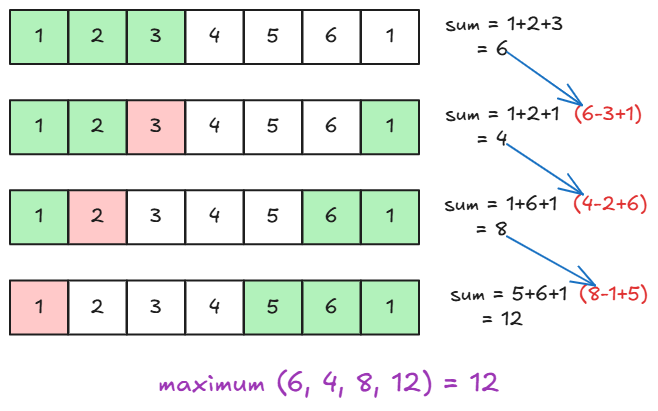
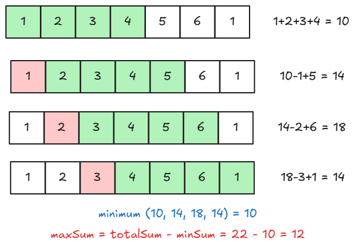

# [🧠 Maximum Points You Can Obtain From Cards](https://leetcode.com/problems/maximum-points-you-can-obtain-from-cards/description/)

## 🤔 Problem

Given an array `arr` of `n` integers and an integer `k`, you may take exactly `k` cards from either the start or the end of the array. Maximize the total points obtained.

## 💡 Key Idea

There are two common ways to think about this problem:

- Take some number of cards from the start (say `x`) and the remaining `k-x` from the end — iterate over `x` (works well when `k` is small).
- Equivalent and more general: find a contiguous subarray of size `n-k` to leave behind; the answer is `total_sum - min_subarray_sum` of length `n-k` (sliding window).

## Steps (Sliding Window approach — preferred)

1. Compute `total = sum(arr)`.
2. Let `window = n - k`. Find the sum of the first `window` elements.
3. Slide the window across the array, tracking the minimum window sum.
4. Answer = `total - min_window_sum`.

## 🧾Approach 1 — Pick k from start, then swap with end

```cpp
class Solution {
public:
    int maxScore(vector<int>& arr, int k) {
        int n = arr.size();

        // Take first k cards from the start
        int sum = 0;
        for(int i = 0; i < k; i++){
            sum += arr[i];
        }

        int maxSum = sum;

        // Gradually remove from left and add from right
        int j = n - 1;
        for(int i = k - 1; i >= 0; i--){
            sum -= arr[i];   // remove from start
            sum += arr[j];   // add from end
            j--;
            maxSum = max(sum, maxSum);
        }

        return maxSum;
    }
};
```



## 🧾Approach 2 — Sliding window (remove subarray of size `n-k`)

```cpp
class Solution {
public:
    int maxScore(vector<int>& arr, int k) {
        int n = arr.size();
        int totalSum = accumulate(arr.begin(), arr.end(), 0); // sum of all cards
        int windowSize = n - k; // size of subarray to leave behind

        int curr = 0;
        // sum of first window
        for(int i = 0; i < windowSize; i++){
            curr += arr[i];
        }

        int minSum = curr; // minimum sum of subarray we leave behind

        // slide the window
        for(int i = windowSize; i < n; i++){
            curr += arr[i];                 // add next element to window
            curr -= arr[i - windowSize];    // remove first element of previous window
            minSum = min(minSum, curr);     // update minimum sum
        }

        return totalSum - minSum; // max score = total - sum of left-behind
    }
};
```



## ⏱️ Complexity

- **Time:** O(n) — sliding window scans the array once. The first approach is O(k) for computing initial sum then O(k) for swaps (O(k) total), which can be faster for very small `k`.
- **Space:** O(1) — only a few integer variables are used.

## ⚖️ Comparison (quick)

| Feature     |                  Pick-k-then-swap |                             Sliding-window (n-k) |
| ----------- | --------------------------------: | -----------------------------------------------: |
| Idea        | Start with first k, swap with end | Leave contiguous `n-k` subarray with minimum sum |
| Time        |                              O(k) |                                             O(n) |
| When to use |         Small `k` or quick ad-hoc |           General, most cases, clearer intuition |

## Quick checklist

- Compute `total` once.
- If using sliding window, ensure window length = `n-k` and handle `k == n` edge case.
- Keep code simple and avoid extra containers.

## Pro tip

- The sliding-window complement trick (choose what to leave) is a common pattern when you must pick from both ends.
