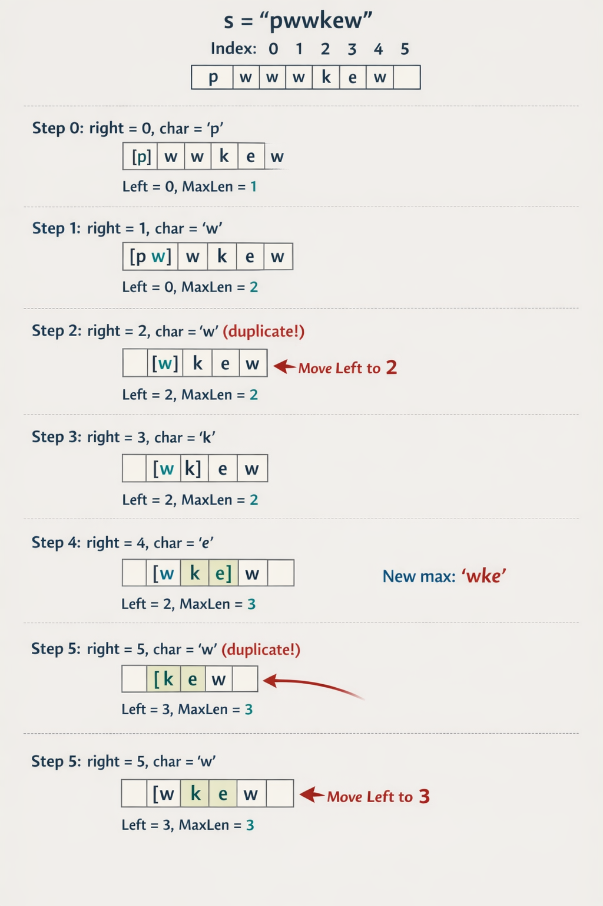

# [🧠 Longest Substring Without Repeating Characters](https://leetcode.com/problems/longest-substring-without-repeating-characters/description/)

## 🤔 Problem

Given a string `s`, find the length of the longest substring without repeating characters.

## 💡 Key Idea (Sliding Window)

- Maintain a window `[left...right]` that always has unique characters.
- Expand `right` to include a new character.
- If duplicate appears, move `left` until the window is valid again (or jump `left` directly using last seen index).
- Track the maximum window length.

## 🐢 Brute Force Approach

### Steps

1. Start from every index `i`.
2. Use a local hash/visited array for the current substring.
3. Expand `j` from `i` until a duplicate character appears.
4. Update `maxLen` with the window size.

### 🧾 Code

```cpp
class Solution {
public:
    int lengthOfLongestSubstring(string s) {
        int n = s.length();
        int maxLen = 0;

        for (int i = 0; i < n; i++) {
            vector<int> hash(256, 0); // keeps track of characters in the current substring
            for (int j = i; j < n; j++) {
                if (hash[s[j]] == 1)
                    break;
                hash[s[j]] = 1;
                maxLen = max(maxLen, j-i+1);
            }
        }

        return maxLen;
    }
};
```

### Complexity

```
⏱️ Time: O(n²)
📦 Space: O(σ) (or O(1) for fixed alphabet)
```


## ⚡ Better Sliding Window (with inner while)

### Steps

1. Keep two pointers: `left` and `right`.
2. Expand `right` one character at a time.
3. If current character is duplicate, keep moving `left` and remove characters from the window.
4. Once unique, update `maxLen`.

### 🧾 Code

```cpp
class Solution {
public:
    int lengthOfLongestSubstring(string s) {
        int n = s.length();

        vector<int> hash(255, 0);

        int maxLen = 0;
        int left = 0;
        int right = 0;

        while (right < n) {
            while (hash[s[right]] == 1) {
                hash[s[left]] = 0;
                left++;
            }
            hash[s[right]] = 1;
            maxLen = max(maxLen, right - left + 1);
            right++;
        }

        return maxLen;
    }
};
```

### Complexity

```
⏱️ Time: O(2n) = O(n)
📦 Space: O(σ) (or O(1) for fixed alphabet)
```


## 🚀 Optimal Approach (last-seen index jump)

### Steps

1. Store last index of every character in `charIndex`.
2. Move `right` from left to right.
3. If `s[right]` was seen inside current window, jump `left` to `charIndex[s[right]] + 1`.
4. Update current character index and `maxLen`.

### 🧾 Code

```cpp
class Solution {
public:
    int lengthOfLongestSubstring(string s) {
        unordered_map<char, int> charIndex; // store last index of character
        int maxLen = 0;
        int left = 0;

        for (int right = 0; right < s.size(); right++) {
            if (charIndex.find(s[right]) != charIndex.end()) {
                // Move left to previous index + 1, but only forward
                left = max(left, charIndex[s[right]] + 1);
            }

            charIndex[s[right]] = right; // update last seen index
            maxLen = max(maxLen, right - left + 1);
        }

        return maxLen;
    }
};
```

### Complexity

```
⏱️ Time: O(n)
📦 Space: O(σ) (or O(1) for fixed alphabet)
```


## Example

- Input: `"pwwkew"`
- Output: `3` (`"wke"` or `"kew"`)

## Quick Checklist

- Use sliding window for variable-length unique substring problems.
- Keep `left` monotonic (never move backward).
- Use last-seen jump for cleaner and faster logic.

## Pro Tip

- For ASCII, array-based tracking is faster; for larger charset/Unicode, use hashmap.


