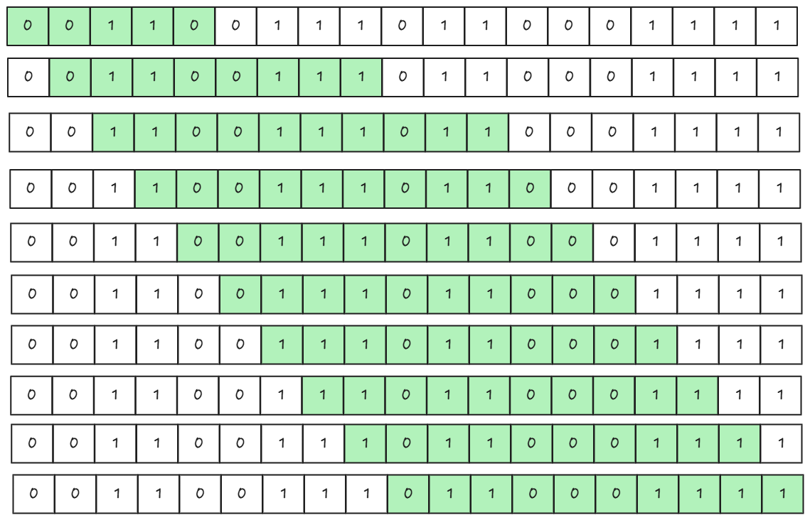

# [🧠 Max Consecutive Ones III](https://leetcode.com/problems/max-consecutive-ones-iii/description/)

## 🤔 Problem

Given a binary array `nums` and an integer `k`, return the maximum number of consecutive `1`s in the array if you can flip at most `k` zeros.

## 💡 Key Idea (Sliding Window)

- Maintain a window `[l...r]` that contains at most `k` zeros.
- Expand `r` one step at a time.
- If zero count exceeds `k`, move `l` forward until the window becomes valid.
- Track the largest valid window length.

## 🚀 Optimal Sliding Window

### Steps

1. Initialize `l = 0`, `zero = 0`, and `maxLen = 0`.
2. Move `r` from left to right.
3. If `nums[r] == 0`, increment zero count.
4. If zeros exceed `k`, shrink from left and reduce zero count when passing a zero.
5. Update `maxLen` with `r - l + 1`.

### 🧾 Code

```cpp
class Solution {
public:
    int longestOnes(vector<int>& nums, int k) {
        int n = nums.size();
        int l=0;
        int maxLen=0;
        int zero = 0;

        for(int r=0; r<n; r++){
            if(nums[r] == 0) zero++;

            if(zero > k){
                if(nums[l] == 0) zero --;
                l++;
            }
            maxLen = max(maxLen, r-l+1);
        }

        return maxLen;
    }
};
```

### Complexity

```
⏱️ Time: O(n)
📦 Space: O(1)
```

---

## Example

- Input: `nums = [1,1,1,0,0,0,1,1,1,1,0], k = 2`
- Output: `6`

## Quick Checklist

- Keep zero count inside the current window.
- Window is valid only when `zero <= k`.
- Update answer after window adjustment.

## Pro Tip

- This is the same pattern as longest subarray with at most `k` bad elements.


