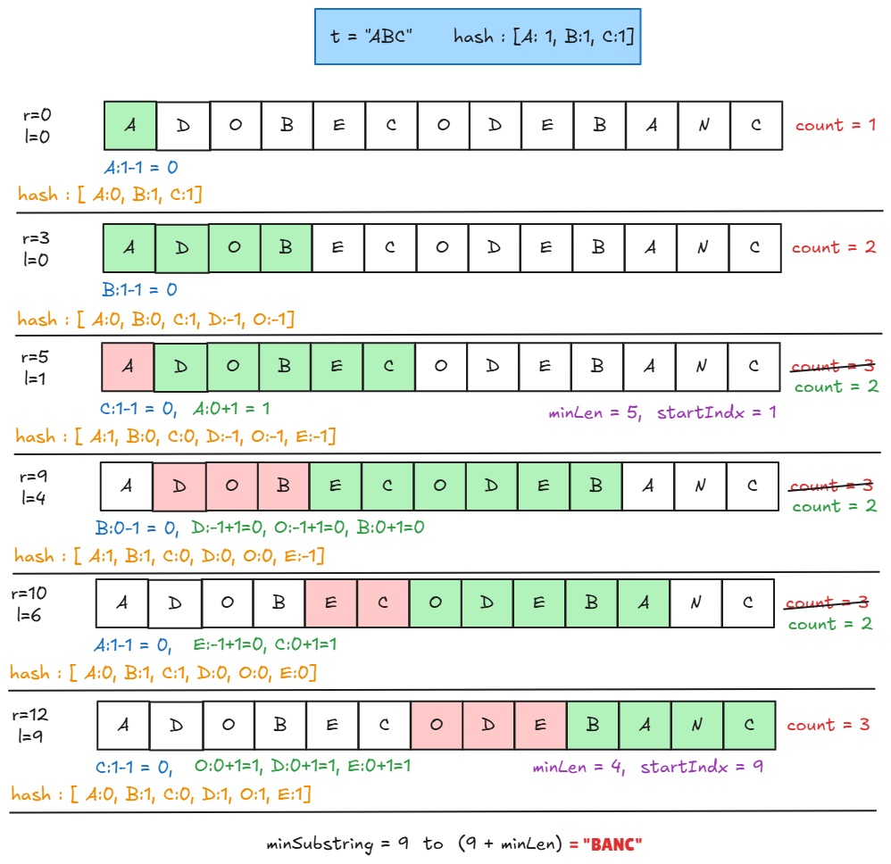

# [🧠 Minimum Window Substring](https://leetcode.com/problems/minimum-window-substring/description/)

## 🐢 Brute Force Approach

### 💡 Idea

- Try every possible starting index
- Maintain a frequency map of string `t`
- Expand window until all characters are matched
- Track minimum length window

### ⏱️ Complexity

- Time: **O(n² \* m)**
- Space: **O(1)** (constant hashmap size)


### 🧾 Code (Brute Force)

```cpp
class Solution {
public:
    string minWindow(string s, string t) {
        int n = s.size();
        int m = t.size();

        // Edge case: if t is larger than s, no valid window exists
        if (m > n) return "";

        int minLen = INT_MAX;
        int startIndex = -1;    // starting index of that window

        for (int i = 0; i < n; i++) {

            // Step 1: Store frequency of characters of t
            unordered_map<char, int> freq;
            for (char ch : t) {
                freq[ch]++;
            }

            int matchedCount = 0; // number of matched characters

            // Step 2: Expand window from i to right
            for (int j = i; j < n; j++) {

                // if current character is previously inserted into freq hash by t then increase matchedCount
                if (freq[s[j]] > 0) {
                    matchedCount++;
                }

                // Decrease frequency (consume the character)
                freq[s[j]]--;

                // Step 3: If all characters of t are matched
                if (matchedCount == m) {

                    int windowLen = j - i + 1;

                    // Update minimum window if smaller found
                    if (windowLen < minLen) {
                        minLen = windowLen;
                        startIndex = i;
                    }

                    // No need to expand further from this i
                    break;
                }
            }
        }

        // If no valid window found
        if (startIndex == -1) return "";

        /*
        string subString = "";
        for (int i = startIndex; i < startIndex + minLen; i++) {
            subString += s[i];
        }
        return subString;
        */

        // Return the minimum window substring
        return s.substr(startIndex, minLen);
    }
};
```


## ⚡ Optimal Approach (Sliding Window)

### 💡 Idea

- Use two pointers (`l`, `r`)
- Expand window using `r`
- Shrink window using `l` when valid
- Maintain frequency map
- Track minimum window

### 🔑 Key Logic

- `freq[ch] > 0` → needed character
- `freq[ch] <= 0` → extra character
- `matchedCount == m` → valid window

### ⏱️ Complexity

- Time: **O(n + m)**
- Space: **O(1)**


### 🧾 Code (Optimal)

```cpp
class Solution {
public:
    string minWindow(string s, string t) {
        int n = s.size();
        int m = t.size();
        if (m > n)
            return "";

        int minLen = INT_MAX;
        int startIndex = -1;

        int l = 0;
        int matchedCount= 0;

        unordered_map<char, int> freq;

       // Store frequency of characters in t
        for (char ch : t) {
            freq[ch]++;
        }

        for (int r = 0; r < n; r++) {

            if (freq[s[r]] > 0) matchedCount++;  

            freq[s[r]]--;

            while (matchedCount== m) {
                if (r - l + 1 < minLen) {
                    minLen = r - l + 1;
                    startIndex = l;
                }

                // Shrink window from left
                freq[s[left]]++;

                // If a required character is removed, decrease match count
                if (freq[s[left]] > 0) {
                    matchedCount--;
                }

                left++; // move left pointer
            }
        }


        if (startIndex == -1)
            return "";

        return s.substr(startIndex, minLen);
    }
};
```


## 🖼️ Visualization


