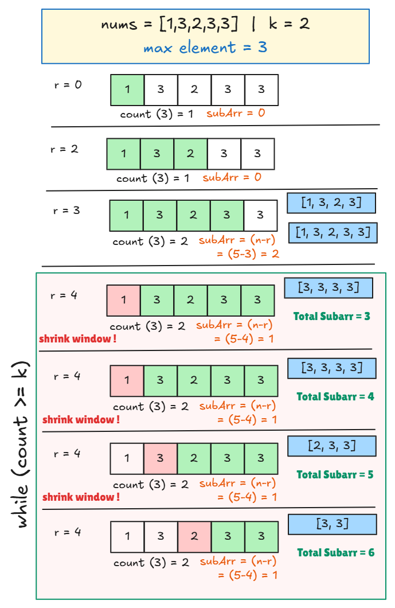

# [🧠 Number of Subarrays Where Max Element Appears At Least Times](https://leetcode.com/problems/count-subarrays-where-max-element-appears-at-least-k-times/description/)

## 🤔 Problem

Given:

* An array `nums`
* An integer `k`

👉 Count the number of **contiguous subarrays** where:

```text
maximum element appears at least k times
```


## 💡 Core Concept

* Subarrays ⇒ continuous
* Condition ⇒ frequency of **maximum element ≥ k**

👉 First find:

```text
maxi = max element of array
```

Then:

* Track only **count of maxi**
* Ignore all other elements


## 🐢 Brute Force Approach

### Idea

* Generate all subarrays
* Count occurrences of `maxi`
* If `count ≥ k` → include it


### 🧾 Code

```cpp
class Solution {
public:
    long long countSubarrays(vector<int>& nums, int k) {
        int n = nums.size();
        int maxi = *max_element(nums.begin(), nums.end());

        long long countSubarrays = 0;

        for (int i = 0; i < n; i++) {
            int count = 0;

            for (int j = i; j < n; j++) {
                if (nums[j] == maxi) count++;

                if (count >= k) {
                    countSubarrays++;
                }
            }
        }

        return countSubarrays;
    }
};
```


### Complexity

```
⏱️ Time: O(n²)
📦 Space: O(1)
```


## 🚀 Optimal Approach (Sliding Window)

### Idea

* Use two pointers (`l`, `r`)
* Track count of `maxi`
* Expand `r`
* When condition satisfied → shrink `l`


## 🔥 Key Formula

When:

```text
count >= k
```

👉 Add:

```text
subarrays = (n - r)
```

## 🧠 Why `(n - r)`?

If `[l...r]` is valid:

```text
[l...r], [l...r+1], [l...r+2], ... [l...n-1]
```

👉 Total:

```text
n - r
```


### 🧾 Code

```cpp
class Solution {
public:
    long long countSubarrays(vector<int>& nums, int k) {
        int n = nums.size();
        int maxi = *max_element(nums.begin(), nums.end());

        int l = 0;
        int count = 0;
        long long subArr = 0;

        for (int r = 0; r < n; r++) {
            if (nums[r] == maxi) count++;

            while (count >= k) {
                subArr += (n - r);

                if (nums[l] == maxi) count--;
                l++;
            }
        }

        return subArr;
    }
};
```


### Complexity

```
⏱️ Time: O(n)
📦 Space: O(1)
```
## 🖼️ Visualization




## 🔍 Example

```
nums = [1,3,2,3,3], k = 2
```

Valid subarrays:

```
[1,3,2,3]
[1,3,2,3,3]
[3,2,3]
[3,2,3,3]
[2,3,3]
[3,3]
```

✔ Output: `6`


## ⚡ Pattern Recognition

Whenever you see:

* Subarray
* Frequency condition
* “At least k times”

👉 Think:

```
Sliding Window + Count frequency
```


## 🔥 Final Takeaway

* Brute force ⇒ generate all subarrays
* Optimal ⇒ sliding window
* Key trick:

```
count >= k → add (n - r)
```


