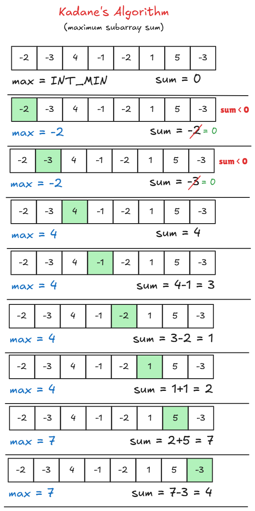

# [🧠 Maximum Subarray Sum](https://leetcode.com/problems/maximum-subarray/)

# 🤔 Problem

Given:

```text
Array of integers (can be negative)
```

👉 Find:

```text
Maximum possible sum of any contiguous subarray
```


# 🐢 Brute Force Approach (Generate All Subarrays)

## 💡 Idea

👉 Generate all subarrays
👉 Compute sum of each
👉 Track maximum


## 🧾 Code

```cpp
class Solution {
public:
    int maxSubArray(vector<int>& nums) {
        int n = nums.size();
        int maxSum = INT_MIN;

        for (int i = 0; i < n; i++) {
            for (int j = i; j < n; j++) {
                int sum = 0;
                for (int k = i; k <= j; k++) {
                    sum += nums[k];
                }
                maxSum = max(maxSum, sum);
            }
        }

        return maxSum;
    }
};
```


## ⏱️ Complexity

```text
Time: O(n³)
Space: O(1)
```


## ❗ Drawback

```text
Too slow (TLE for large inputs)
```


# ⚡ Better Approach (Prefix / Running Sum)

## 💡 Idea

👉 Avoid recomputing sum
👉 Keep running sum inside inner loop


## 🧾 Code

```cpp
class Solution {
public:
    int maxSubArray(vector<int>& nums) {
        int n = nums.size();
        int maxSum = INT_MIN;

        for (int i = 0; i < n; i++) {
            int sum = 0;
            for (int j = i; j < n; j++) {
                sum += nums[j];
                maxSum = max(maxSum, sum);
            }
        }

        return maxSum;
    }
};
```


## ⏱️ Complexity

```text
Time: O(n²)
Space: O(1)
```


## ❗ Drawback

```text
Still not optimal
```


# 🚀 Optimal Approach (Kadane’s Algorithm)

## 💡 Idea

👉 Drop negative prefix
👉 Keep extending positive sum


## 🧾 Code (Your Code — Correct ✅)

```cpp
class Solution {
public:
    int maxSubArray(vector<int>& nums) {
        int n = nums.size();
        int sum = 0;
        int maxSum = INT_MIN;

        for(int i = 0; i < n; i++){
            sum += nums[i];
            maxSum = max(sum, maxSum);

            if(sum < 0) sum = 0;
        }

        return maxSum;
    }
};
```


## ⏱️ Complexity

```text
Time: O(n)
Space: O(1)
```
## 🖼️ Visualization




## ⚠️ Important Edge Case

```text
All numbers negative
```

👉 Handled because:

```cpp
maxSum = INT_MIN;
```


# 🔥 How to Print the Subarray (Very Important ⭐)

👉 Track indices


## 🧾 Code (Print Subarray)

```cpp
class Solution {
public:
    int maxSubArray(vector<int>& nums) {
        int sum = 0, maxSum = INT_MIN;
        int start = 0, ansStart = 0, ansEnd = 0;

        for (int i = 0; i < nums.size(); i++) {

            if (sum == 0) start = i;   // potential start

            sum += nums[i];

            if (sum > maxSum) {
                maxSum = sum;
                ansStart = start;
                ansEnd = i;
            }

            if (sum < 0) sum = 0;
        }

        // Print subarray
        cout << "Subarray: ";
        for (int i = ansStart; i <= ansEnd; i++) {
            cout << nums[i] << " ";
        }

        cout << endl;

        return maxSum;
    }
};
```


## 🧠 Key Trick

```text
When sum becomes 0 → new subarray may start
```


# 🔥 Pattern Recognition

This is:

```text
Dynamic Programming (Greedy Optimization)
```

👉 Base of:

* Kadane’s Algorithm
* Stock Buy/Sell
* Maximum Product Subarray


# 🎯 Final Takeaway

```text
If problem says:
→ "maximum subarray"
→ "contiguous sum"

Think immediately:
👉 Kadane’s Algorithm
```
