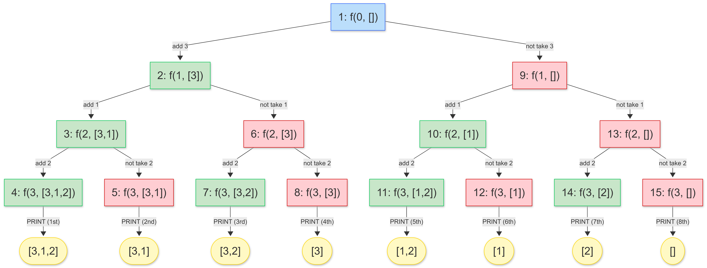
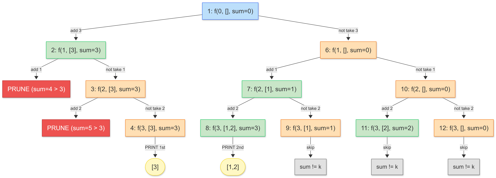
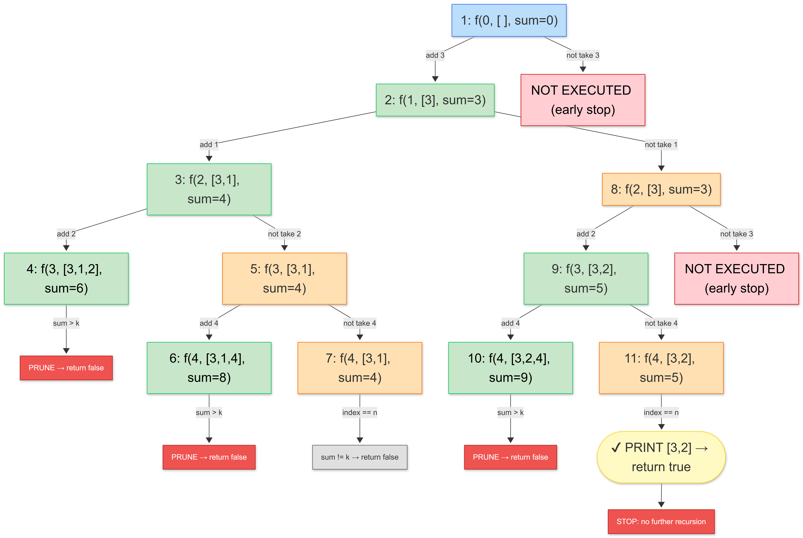

# 🧠 Generating Subsequences (Recursion + Backtracking)

## 🤔 Problem

Given an array `arr`, generate **all possible subsequences**.

👉 A subsequence is:

- any combination of elements
- **order preserved**
- can be empty

## 💡 Key Idea

At every index, you have **2 choices**:

```text
1. TAKE the element
2. NOT TAKE the element
```

👉 This creates a **binary recursion tree**

## 🌳 Recursion Pattern

```cpp
f(index, ds)
```

- `index` → current position
- `ds` → current subsequence

### Base Case

```cpp
if (index == n) {
    print(ds);
    return;
}
```

## 🔁 Core Logic

```cpp
// TAKE
ds.push_back(arr[index]);
f(index + 1, ds);

// BACKTRACK
ds.pop_back();

// NOT TAKE
f(index + 1, ds);
```

## 🧾 Code

```cpp
class Solution {
public:
    void generateSubsequence(int index, vector<int>& ds, vector<int>& arr) {
        if (index == arr.size()) {
            // print ds
            return;
        }

        // TAKE
        ds.push_back(arr[index]);
        generateSubsequence(index + 1, ds, arr);

        // BACKTRACK
        ds.pop_back();

        // NOT TAKE
        generateSubsequence(index + 1, ds, arr);
    }
};
```

## 🌳 Recursion Tree (Example: `[3,1,2]`)



## 🧾 Output Order

```text
[3,1,2]
[3,1]
[3,2]
[3]
[1,2]
[1]
[2]
[]
```

## ⚡ Complexity

```text
⏱️ Time: O(2^n)
📦 Space: O(n) recursion stack
```

## 🔥 Key Observations

### 1. Total subsequences

```text
2^n
```

👉 Because each element has 2 choices

### 2. DFS Execution

- Always go **TAKE → TAKE → TAKE**
- then backtrack
- then explore **NOT TAKE**

### 3. Backtracking is MUST

```cpp
ds.pop_back();
```

👉 Without this → wrong answers (state pollution)

## 🚀 Optimization / Variations

### 1. Store instead of print

```cpp
ans.push_back(ds);
```

### 🗒️ Code

```cpp
class Solution {
public:
    void generate(int index, vector<int>& ds, vector<int>& arr, vector<vector<int>>& ans) {
        if (index == arr.size()) {
            ans.push_back(ds); // store
            return;
        }

        // TAKE
        ds.push_back(arr[index]);
        generate(index + 1, ds, arr, ans);

        // BACKTRACK
        ds.pop_back();

        // NOT TAKE
        generate(index + 1, ds, arr, ans);
    }

    vector<vector<int>> getAllSubsequences(vector<int>& arr) {
        vector<vector<int>> ans;
        vector<int> ds;
        generate(0, ds, arr, ans);
        return ans;
    }
};
```

### ⏰ Complexity

```text
Time: O(2^n)
Space: O(2^n * n)
```

### 2. Generate only subsequences with sum = k

👉 Add condition at base case

### 🗒️ Code

```cpp
class Solution {
public:
    void generate(int index, int sum, int k,
                  vector<int>& ds, vector<int>& arr,
                  vector<vector<int>>& ans) {

         // PRUNING (optimization)
        if (sum > k) return;

        if (index == arr.size()) {
            if (sum == k) {
                ans.push_back(ds);
            }
            return;
        }

        // TAKE
        ds.push_back(arr[index]);
        generate(index + 1, sum + arr[index], k, ds, arr, ans);

        // BACKTRACK
        ds.pop_back();

        // NOT TAKE
        generate(index + 1, sum, k, ds, arr, ans);
    }

    vector<vector<int>> subsequenceSumK(vector<int>& arr, int k) {
        vector<vector<int>> ans;
        vector<int> ds;
        generate(0, 0, k, ds, arr, ans);  // k = 3
        return ans;
    }
};
```

### ⏰ Complexity

```text
Time: O(2^n)
Space: O(n)
```

### 🌳 Recursion Tree (Example: `[3,1,2], k = 3`)




### 3. Count no of subsequences with sum = k

#### 🧠 KEY IDEA (VERY IMPORTANT)

👉 Instead of:

```cpp
print(ds);
```

You do:

```cpp
return 1;   // if valid
return 0;   // if not valid
```

👉 Then add results from left + right

```cpp
count = take + notTake
```

✔ This is the core idea used in recursion counting problems

### 🗒️ Code

```cpp
class Solution {
public:
    int countSubsequence(int index, int sum, int k, vector<int>& arr) {

        // PRUNING (only if all numbers are positive)
        if (sum > k) return 0;

        // BASE CASE
        if (index == arr.size()) {
            if (sum == k) return 1; // found one valid subsequence
            return 0;
        }

        // TAKE
        int take = countSubsequence(index + 1, sum + arr[index], k, arr);

        // NOT TAKE
        int notTake = countSubsequence(index + 1, sum, k, arr);

        // TOTAL COUNT
        return take + notTake;
    }
};
```

### 4. Print only ONE valid subsequence

👉 Return boolean and stop early

```text
🔥 Key Idea
return true;

👉 This cuts the recursion tree early
```

### 🗒️ Code

```cpp
class Solution {
public:
    bool generate(int index, int sum, int k,
                  vector<int>& ds, vector<int>& arr) {

         // PRUNING (optimization)
        if (sum > k) return false;

        if (index == arr.size()) {
            if (sum == k) {
                // print ds
                return true; // STOP
            }
            return false;
        }

        // TAKE
        ds.push_back(arr[index]);
        if (generate(index + 1, sum + arr[index], k, ds, arr))
            return true;

        // BACKTRACK
        ds.pop_back();

        // NOT TAKE
        if (generate(index + 1, sum, k, ds, arr))
            return true;

        return false;
    }
};
```

## 🌳 Recursion Tree (Example: `arr = [3,1,2,4], k = 5`)



## 🔍 Example

Input:

```text
arr = [3,1,2]
```

Output:

```text
8 subsequences
```

## ⚡ Quick Checklist

- Always base case → `index == n`
- Do:

```text
  TAKE → recurse → BACKTRACK → NOT TAKE
```

- Track `ds` carefully
- Think in **tree form**

## 🚀 Pro Tip (VERY IMPORTANT)

Whenever you see:

- "generate all combinations"
- "subsequence / subset"
- "include or exclude"

👉 Think:

```text
Binary Choice → Recursion Tree → 2^n
```

### ⚠️ Pruning Condition (VERY IMPORTANT)

```cpp
if (sum > k) return;   // pruning
```

✅ Valid ONLY when:
>All elements in the array are POSITIVE

👉 Because once `sum > k`, adding more positive numbers will only increase the sum further — so no valid solution can exist.