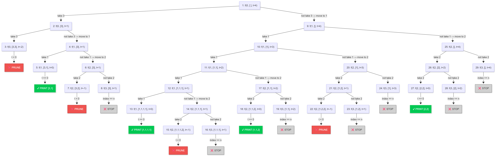
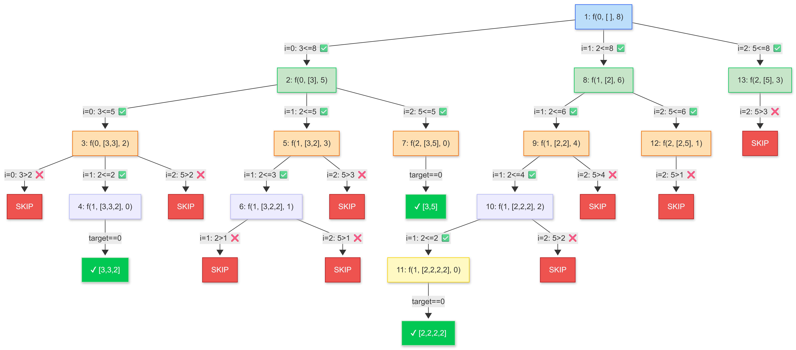

# 🧠 Combination Sum I (Backtracking)

## 🤔 Problem

Given:

```cpp
arr = candidates (distinct, positive)
target
```

👉 Find all combinations such that:

- sum = target
- **reuse allowed**
- order doesn’t matter

## 💡 Core Idea

```text
At each index:
1. TAKE → stay at same index (reuse)
2. NOT TAKE → move to next index
```

👉 This builds a **recursion tree (DFS)**

## 🌳 Version 1: TAKE / NOT TAKE (Binary Recursion)

## 🔁 Pattern

```cpp
f(index, target)
```

### Base Cases

```cpp
if (target == 0) → store answer
if (target < 0 || index == n) → return
```

## 🧾 Code

```cpp
class Solution {
public:
    void solve(int index, int target,
               vector<int>& ds,
               vector<int>& arr,
               vector<vector<int>>& ans) {

        if (target == 0) {
            ans.push_back(ds);
            return;
        }

        if (index == arr.size() || target < 0) {
            return;
        }

        // TAKE (reuse same index)
        ds.push_back(arr[index]);
        solve(index, target - arr[index], ds, arr, ans);

        // BACKTRACK
        ds.pop_back();

        // NOT TAKE
        solve(index + 1, target, ds, arr, ans);
    }
};
```

## 🌳 Recursion Tree Shape (arr = [3,1,2], target = 4)



```text
Binary Tree (2 branches)
Depth depends on target
```

## ⏱️ Complexity

### Time

- Worst case exponential
- Roughly:

```text
O(2^n)  (intuitive)
OR
O(n^(target/min))  (more accurate)
```

👉 Because:

- depth ≈ target / smallest element
- branching ≈ n

📌 More precise bound:

```text
O(n^(T/M))
```

Where:

- T = target
- M = smallest element

### Space

```text
O(target / min)  (recursion depth)
```

👉 Because we can keep adding smallest element

## 🚀 Version 2: FOR LOOP (Most Used / Clean)

## 💡 Idea

Instead of binary branching:

```text
Loop through all candidates from current index
```

👉 Avoids explicit NOT TAKE

## 🧾 Code

```cpp
class Solution {
public:
    void solve(int index, int target,
               vector<int>& ds,
               vector<int>& arr,
               vector<vector<int>>& ans) {

        if (target == 0) {
            ans.push_back(ds);
            return;
        }

        for (int i = index; i < arr.size(); i++) {

            if (arr[i] > target) continue; // optional pruning

            // TAKE
            ds.push_back(arr[i]);

            // reuse → i (not i+1)
            solve(i, target - arr[i], ds, arr, ans);

            // BACKTRACK
            ds.pop_back();
        }
    }
};
```

## 🌳 Recursion Tree Shape (arr = [3,2,5], target = 8)



```text
N-ary tree (multiple branches)
Cleaner than binary
```

## ⏱️ Complexity

### Time

Same as above:

```text
O(n^(T/M))
```

👉 Because:

- each level → up to n choices

### Space

```text
O(T/M)
```

## ⚔️ TAKE/NOT TAKE vs FOR LOOP

| Feature            | TAKE / NOT TAKE | FOR LOOP     |
| ------------------ | --------------- | ------------ |
| Tree               | Binary          | N-ary        |
| Code clarity       | Medium          | ⭐ Clean     |
| Interview use      | OK              | ⭐ Preferred |
| Flexibility        | Good            | Better       |
| Duplicate handling | Harder          | Easier       |

## 🔥 Key Observations

### 1. Why reuse works?

```cpp
solve(i, target - arr[i])
```

👉 stay at same index

### 2. Why no duplicates?

```text
We only move forward (i → n)
```

👉 never go backward → no permutation duplicates

### 3. Pruning (IMPORTANT)

```cpp
if (target < 0) return;
```

👉 Works because:

```text
All elements are POSITIVE
```

## ⚡ Mental Model

```text
Subsequence → 2 choices → 2^n

Combination Sum → controlled DFS
depth = target-based
```

## 🚀 Final Tip (Interviews)

👉 Always prefer:

```text
FOR LOOP version
```

Because:

- cleaner
- scalable to other problems
- easy duplicate handling (Combination Sum II)
