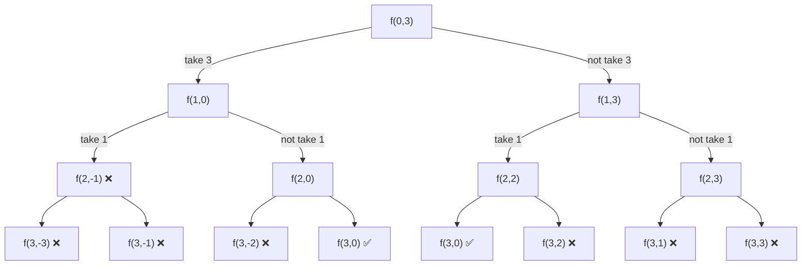
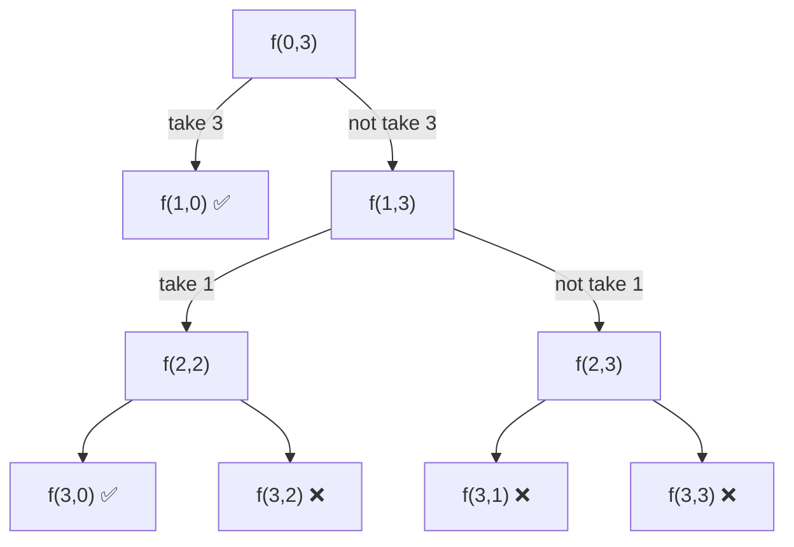
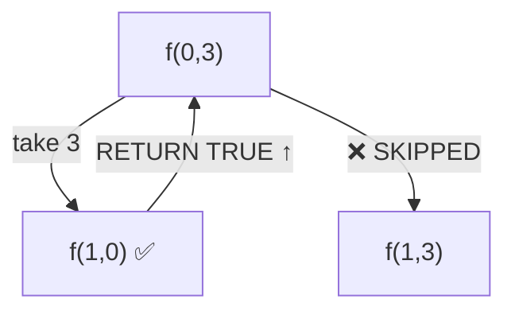

# 🧠 Subset Sum I

## 🤔 Problem

Given:

```cpp
arr = integers (positive)
target = sum
```

👉 Return:

```text
Is there a subset whose sum = target ?
```

# 💡 Core Idea

```text
f(index, sum)
 ├── TAKE → f(index+1, sum - arr[index])
 └── NOT TAKE → f(index+1, sum)
```

## 🐢 Version 1: EXPLORE ALL (Brute Force)

## 🧾 Code

```cpp
bool solve(int index, vector<int>& arr, int sum) {

    if (sum < 0) return false;

    if (index == arr.size()) {
        return sum == 0;
    }

    bool take = solve(index + 1, arr, sum - arr[index]);
    bool notTake = solve(index + 1, arr, sum);

    return take || notTake;
}
```

## 🌳 Recursion Tree



## ❌ Characteristics

* Explores **all paths**
* Includes **negative sums**
* No early stopping

## 🧠 Mental Model

```text
"Try everything → reject later"
```

## 🚚 Version 2: PRUNING (Better)

## 🧾 Code

```cpp
bool solve(int index, vector<int>& arr, int sum) {

    if (sum == 0) return true;
    if (index == arr.size()) return false;

    bool take = false;

    if (arr[index] <= sum) {
        take = solve(index + 1, arr, sum - arr[index]);
    }

    bool notTake = solve(index + 1, arr, sum);

    return take || notTake;
}
```

## 🌳 Recursion Tree



## ✅ Improvements

* No negative sum calls
* Smaller recursion tree
* Early success check (`sum == 0`)

## 🧠 Mental Model

```text
"Only explore valid paths"
```

## 🚀 Version 3: EARLY STOP (Best)

## 🧾 Code (Short-Circuit)

```cpp
bool solve(int index, vector<int>& arr, int sum) {

    if (sum == 0) return true;
    if (index == arr.size()) return false;

    // TAKE
    if (arr[index] <= sum) {
        if (solve(index + 1, arr, sum - arr[index]))
            return true; // 🔥 STOP everything
    }

    // NOT TAKE
    return solve(index + 1, arr, sum);
}
```

## 🌳 Actual Execution Tree



## 🚀 Advantages

* Stops at **first valid subset**
* Avoids exploring remaining tree
* Best practical performance

## 🧠 Mental Model

```text
"Find one answer → STOP everything"
```

# ⚔️ Comparison

| Feature       | 🔴 Explore All | 🟡 Pruning | 🟢 Early Stop |
| ------------- | -------------- | ---------- | ------------- |
| Invalid paths | ✅ Yes          | ❌ No       | ❌ No          |
| Negative sums | ✅ Yes          | ❌ No       | ❌ No          |
| Early success | ❌ No           | ✅ Partial  | ✅ Full        |
| Tree size     | Largest        | Medium     | Smallest      |
| Efficiency    | ❌ Worst        | ✅ Better   | 🚀 Best       |

# ⏱️ Complexity

| Case              | Complexity |
| ----------------- | ---------- |
| Worst             | O(2^n)     |
| Best (early stop) | O(n)       |
| Space             | O(n)       |

# 🔥 Key Insights

### 1. Pruning

```cpp
if(arr[index] <= sum)
```

### 2. Early Stop

```cpp
if (solve(...)) return true;
```

### 3. OR Logic vs Short-Circuit

```text
take || notTake → evaluates both
early return → stops immediately
```

# ⚡ Final Mental Model

```text
Subset → binary choice

Level 1: brute force
Level 2: prune invalid
Level 3: stop early
```
