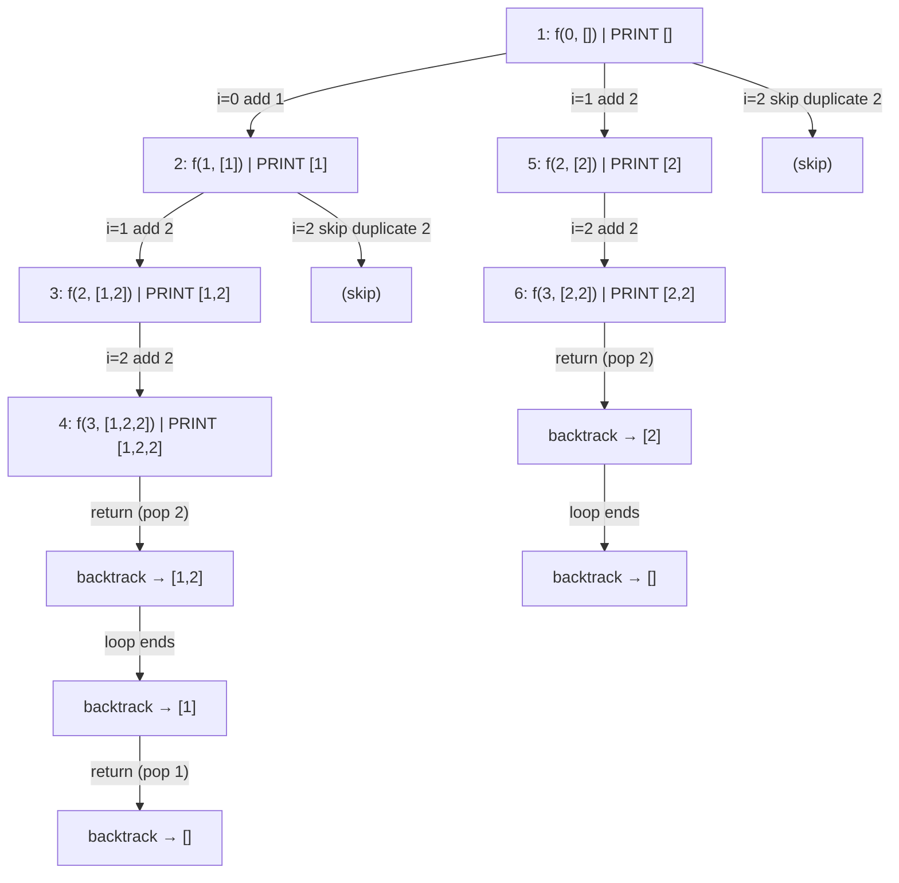
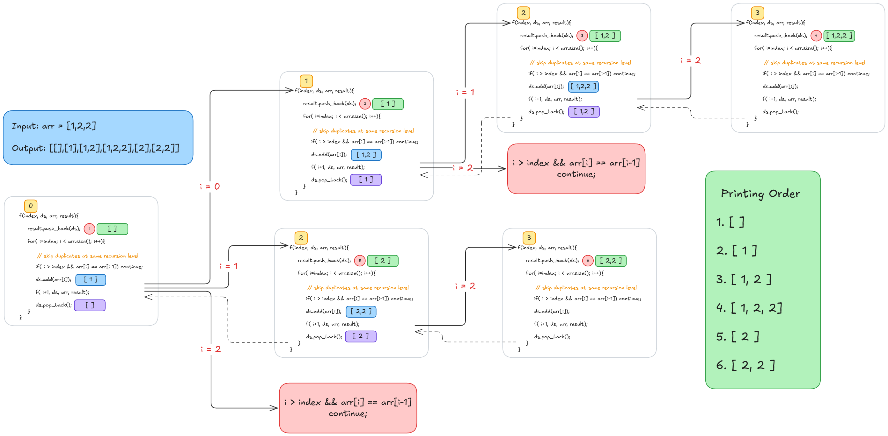

# 🧠 Subsets II (With Duplicates)

## 🤔 Problem

Given:

```cpp
nums (may contain duplicates)
```

👉 Find all **unique subsets**

Constraints:

* No duplicate subsets allowed
* Order inside subset doesn’t matter
* Order of output doesn't matter

## 💡 Core Idea

```text
At each index:
1. TAKE → include element
2. NOT TAKE → skip element
```

BUT ⚠️ problem: duplicates exist → same subset can repeat

## 🌳 Version 1: TAKE / NOT TAKE + SET (Brute Fix)

## 🧠 Strategy

* Generate ALL subsets (including duplicates)
* Store in `set<vector<int>>` to remove duplicates

## 🧾 Code

```cpp
class Solution {
public:
    // Use set to handle duplicates
    set<vector<int>> st;

    void generate(int index,
                  vector<int>& nums,
                  vector<int>& ds) {

        if (index == nums.size()) {
            st.insert(ds);
            return;
        }

        // TAKE
        ds.push_back(nums[index]);
        generate(index + 1, nums, ds);

        // BACKTRACK
        ds.pop_back();

        // NOT TAKE
        generate(index + 1, nums, ds);
    }

    vector<vector<int>> subsetsWithDup(vector<int>& nums) {

        sort(nums.begin(), nums.end()); // first sort to handle duplicates

        vector<int> ds;
        generate(0, nums, ds);

        return vector<vector<int>>(st.begin(), st.end());
    }
};
```

## 🌳 Idea Visualization

Each element has 2 choices:

```text
          []
       /      \
     take     not take
     /            \
  include         skip
```

👉 BUT duplicates explode → handled using `set`

## ⏱ Complexity

### Time

```text
O(2^n log K)
```

* 2^n subsets
* logK insertion in set

```text
k = current set size (number of unique subsets)
K ≈ 2^n in worst case (all unique)
```

### Space

```text
O(2^n)
```

(set storage)

## ❌ Problem with this approach

* Extra space (set)
* Slow
* Not interview optimal

# 🚀 Version 2: Optimized FOR LOOP (STANDARD INTERVIEW SOLUTION)

## 💡 Key Insight

Instead of binary recursion:

```text
Fix a start index
Loop forward
Skip duplicates intelligently
```

## 🧾 Code

```cpp
class Solution {
public:

    void solve(int index,
               vector<int>& nums,
               vector<int>& ds,
               vector<vector<int>>& ans) {

        ans.push_back(ds); // every node is valid subset

        for (int i = index; i < nums.size(); i++) {

            // 🚨 SKIP DUPLICATES (VERY IMPORTANT)
            if (i > index && nums[i] == nums[i - 1]) continue;

            ds.push_back(nums[i]);

            solve(i + 1, nums, ds, ans);

            ds.pop_back();
        }
    }

    vector<vector<int>> subsetsWithDup(vector<int>& nums) {

        sort(nums.begin(), nums.end()); // critical

        vector<vector<int>> ans;
        vector<int> ds;

        solve(0, nums, ds, ans);

        return ans;
    }
};
```

##b 🌳 Mermaid Recursion Tree (WITH EXECUTION ORDER)

Example:

```cpp
nums = [1,2,2]
```

## 🌳 Tree



## 🌀 Code Dry Run (arr = [1, 2, 2])



# ⚡ Key Trick (MOST IMPORTANT)

## 🚫 Why duplicate skipping works

```cpp
if (i > index && nums[i] == nums[i - 1])
    continue;
```

👉 Meaning:

```text
If same level + same value → skip
```

## 🧠 Visual intuition

```text
[1,2,2]

Level 1:
   2 is only allowed once per level

So we avoid:
   [2 from index 1]
   [2 from index 2] ❌ duplicate
```

# 🔥 Final Mental Model

## Subset problems =

```text
Explore all subsets → DFS tree
```

## With duplicates:

```text
Either:
1. brute force + set
2. smart pruning (BEST)
```
